## Azure Event Grid

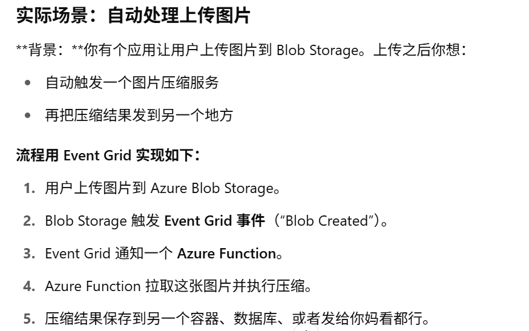

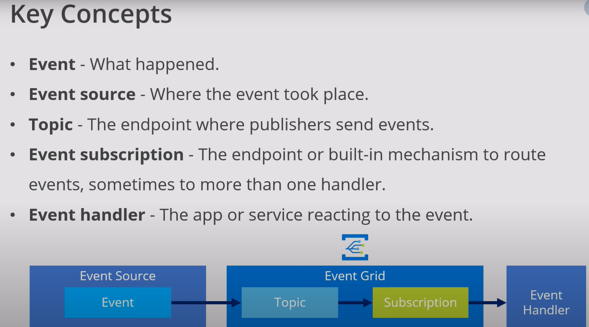

### Senerio 1 Build in event:
1. Create a **storage account** and **logic app**:
It will trigger event when blob is created. Doesn't need event grid yet.

    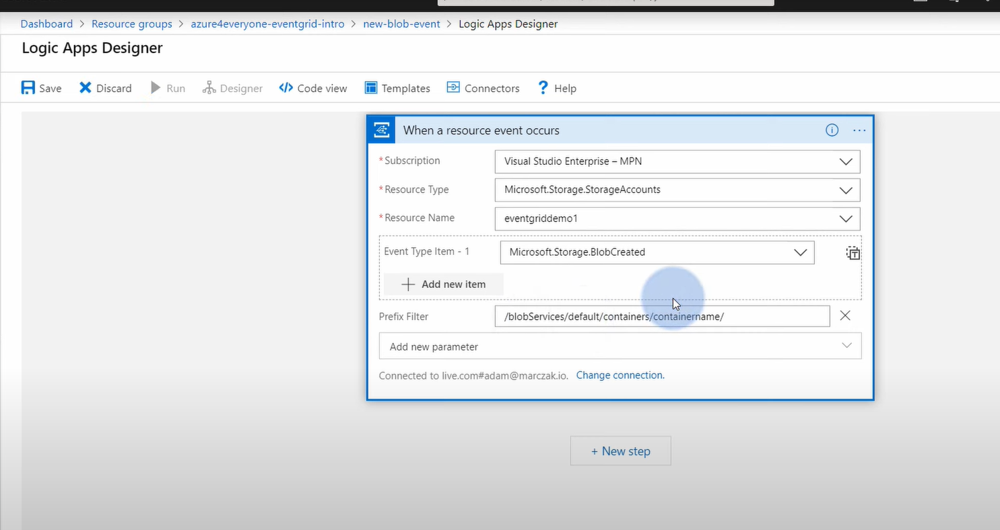

### Senerio 2 custom event(Create a event grid topic that will receive events from logic app):
1. Create event grid topic:

    

    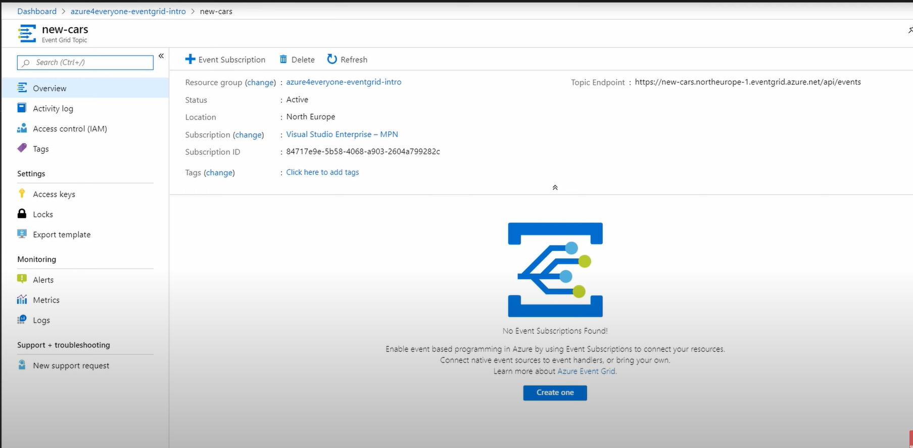

2. Create a logic app and choose Azure Event Grid Publish:
    You get the endpoint and the SAS from the Event Grid.

      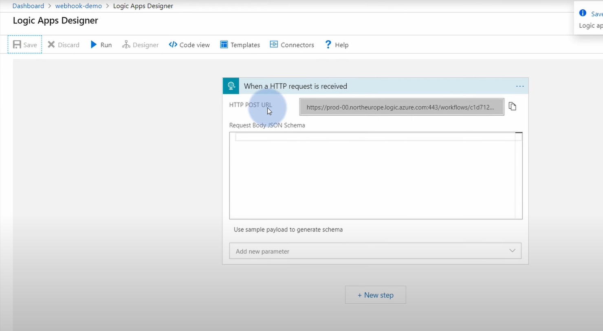

    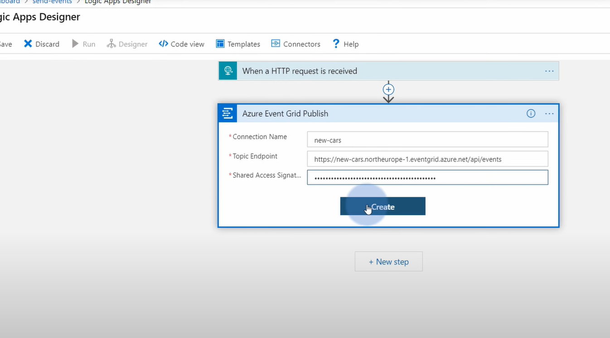

3. Contiune to create a publish event which will send to Event Grid:

    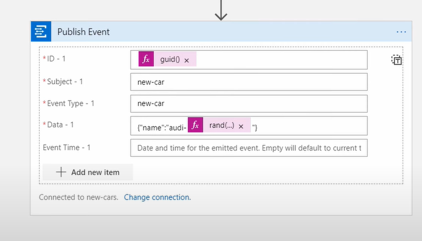

    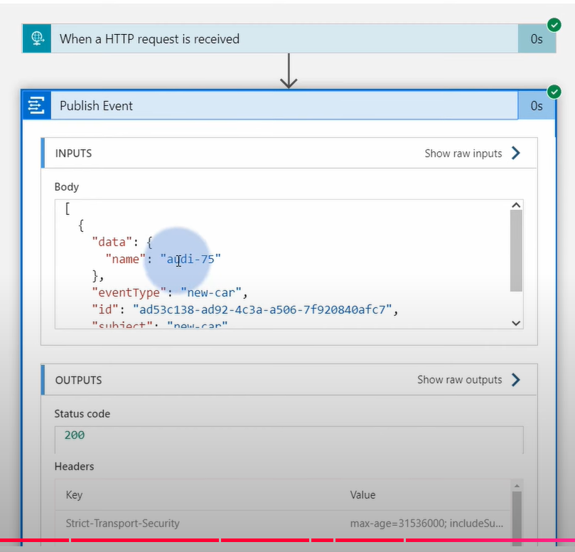

    
### Senerio 3 Event Subsription(will send events from the event grid topic to another destination like logic app):

1. Create an Event Subsription:
    
    Create a logic app and copy the endpoint:

    

    Paste the endpoint to the event subscription:

    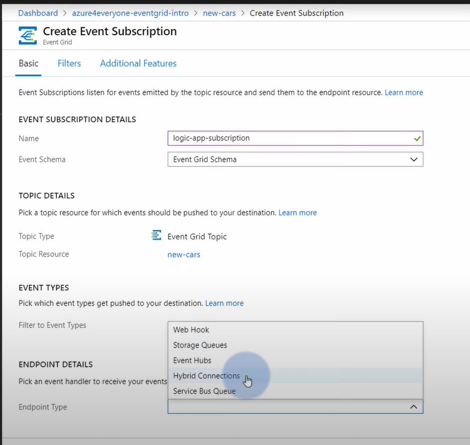

2. When you trigger the logic app to send events to the event grid topic:

    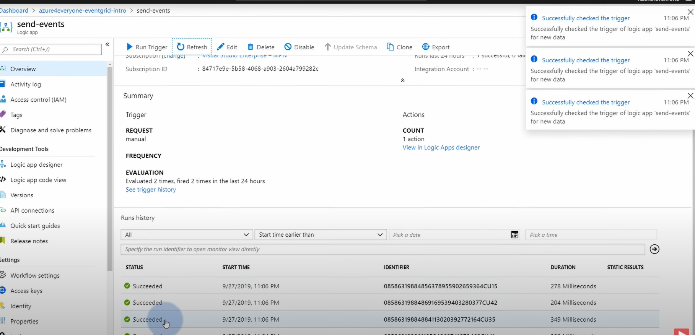

    The web hook logic app will receive the event request:

    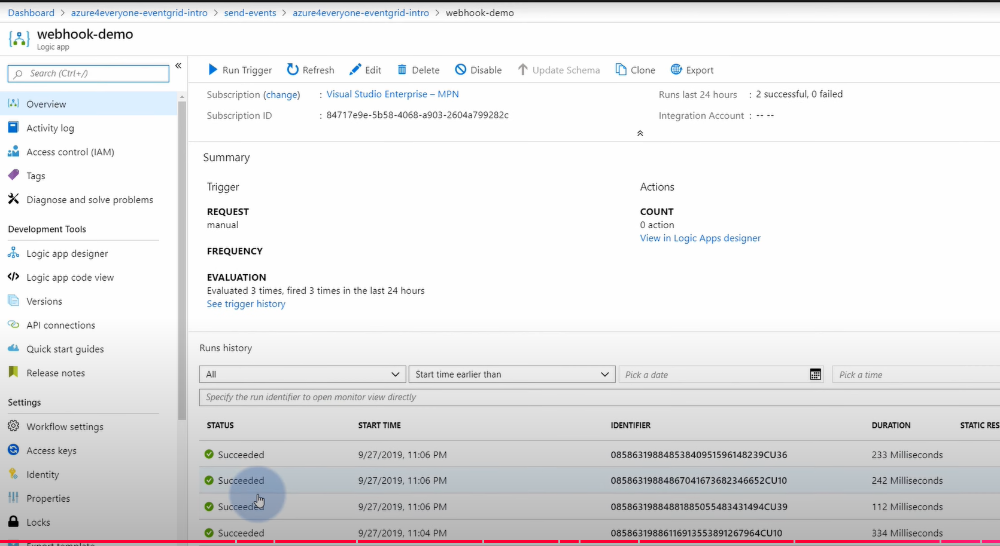    


### Senerio 4 Create multiple Event Subsription(Create one for storage account):

1. Create a storage account queue and a event subscription of destination to the queue:

    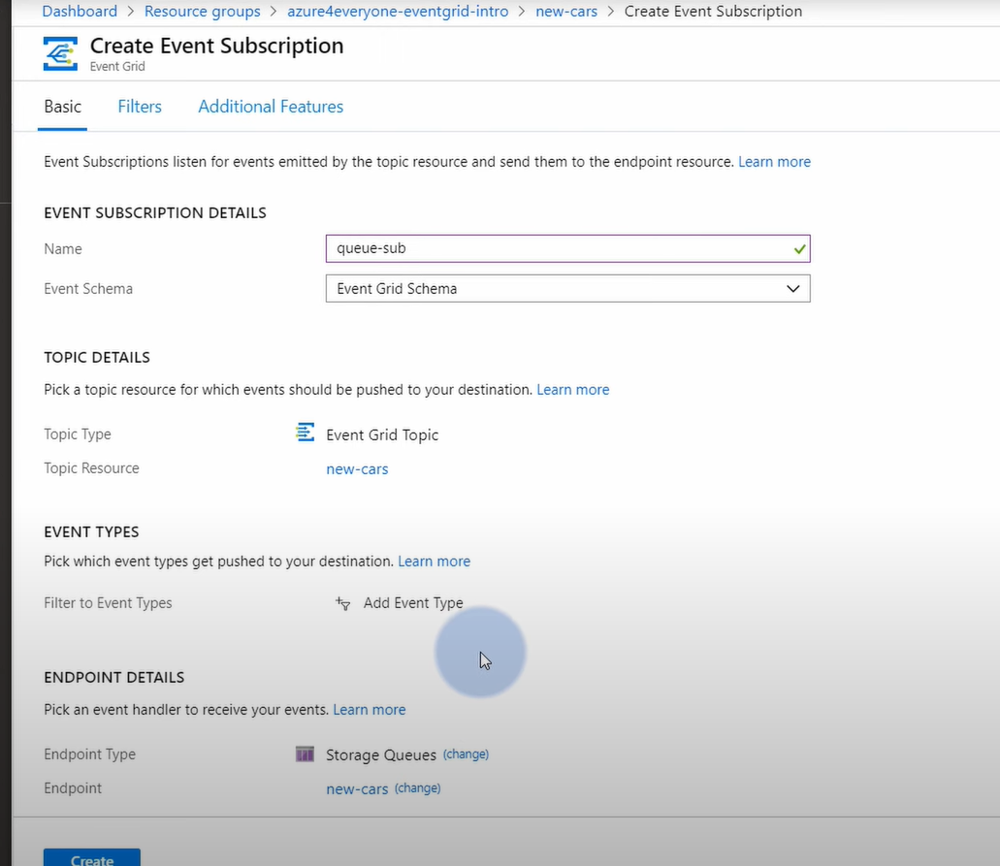

    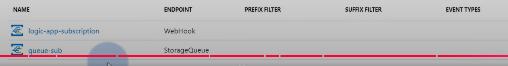

2. When you trigger the logic app to send events to the event grid topic:

    

    The storage account queue will receive and store the events:

    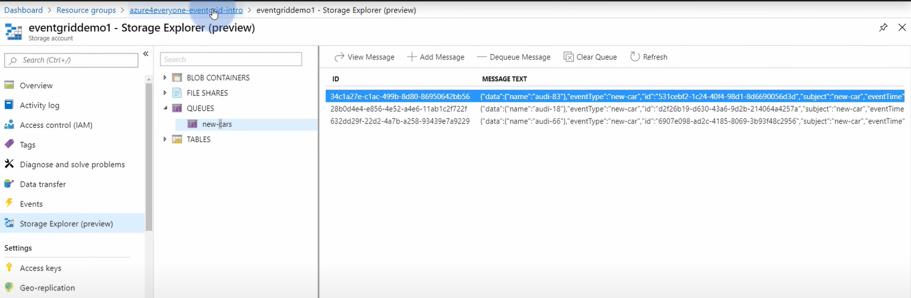


## 实际的例子example：
### Fabrikam 要发的订单内容：
```json
POST https://prod-xxx.logic.azure.com/.../triggers/manual/...

{
  "customerId": "FAB123",
  "itemId": "A001",
  "quantity": 3,
  "priority": "high"
}
```
### 第一步：Logic App 的 HTTP Trigger（Webhook）
你创建一个 Logic App，设置触发器为：
```vbnet
When an HTTP request is received
```
Azure 自动给你一个带签名的 URL，这就是 Webhook 地址。

💡 你把这个地址发给 Fabrikam，他们每次想下单就发请求到这儿

### 第二步：Logic App 中添加 HTTP 动作（调用本地订单系统）
接下来你添加一个 HTTP Action，配置如下：

- Method: POST

- URL: http://intranet-ordersrv/api/neworder
（你内网订单系统的地址）

- Body:
```json
{
  "client": "@{triggerBody()?['customerId']}",
  "item": "@{triggerBody()?['itemId']}",
  "qty": "@{triggerBody()?['quantity']}",
  "rush": "@{triggerBody()?['priority']}"
}
```
💡 这些表达式就是把 Fabrikam 传来的数据“转发”给你本地系统

### 第三步：连接本地系统（用 On-Premises Data Gateway）
为了让 Logic App 能访问你那个 http://intranet-ordersrv 的地址：

你得配置：

- 一个 On-Premises Data Gateway（在你本地 Windows 机上安装）

- 在 Logic App 中创建一个连接器，选择 使用该 Gateway 来调用内部 HTTP 地址

这样 Azure 上的 Logic App 就能“穿越”进你公司内网打那个接口。

### 第四步（可选）：给 Fabrikam 返回响应
在 Logic App 最后加一个 Response 动作，告诉他们订单处理成功：

```json
{
  "status": "Success",
  "orderId": "ORD789"
}
```