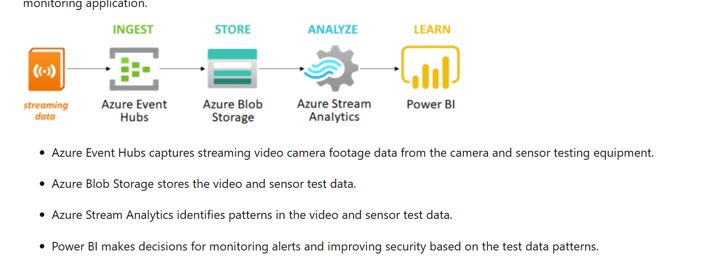
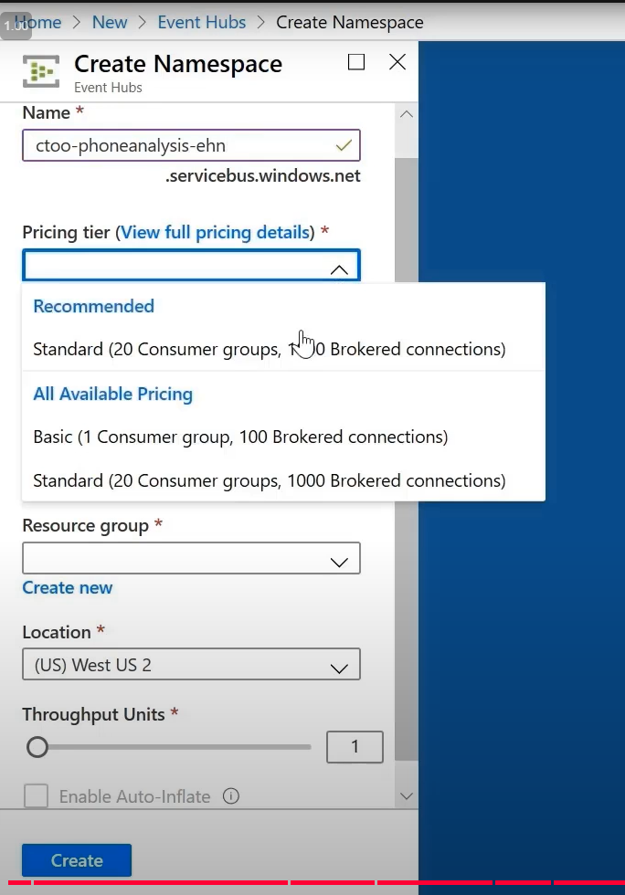
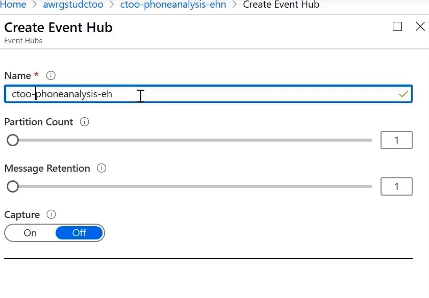

## Azure Event hubs

Lab:
1. Create Event hub namespace:

2. Create Event hub inside the namespace:

you can create multiple event hubs inside one namespace

3.简单的demo：
## Send message到event hub：
本地写一个.net应用发送三个event(message)到event hub：

可以看到三个message被接受：

也可以用azure service比如logic app写message到event hub：

## 接受event hub的message：
1.使用default的consumer group，还需要创建一个storage account：

这样这个本地app就可以监听这个eventhub并且接受message进行下一步动作：

现实可能的情况简易，下单→发message到event hub→订单系统监听event hub→连接数据库扣库存：
// =============================================
// 💻 前端 React（简易下单界面）
// =============================================
// 假设你前端部署在 localhost:3000

function OrderForm() {
  const order = {
    customerId: "123",
    sku: "item001",
    quantity: 2,
    totalAmount: 29.99
  };

  function placeOrder() {
    fetch("https://localhost:5001/api/order", {
      method: "POST",
      headers: { "Content-Type": "application/json" },
      body: JSON.stringify(order)
    })
      .then((res) => res.ok ? alert("下单成功") : alert("下单失败"));
  }

  return <button onClick={placeOrder}>立即下单</button>;
}

// =============================================
// 🧠 后端 ASP.NET Core - OrderController.cs
// =============================================

[ApiController]
[Route("api")]
public class OrderController : ControllerBase
{
    private readonly OrderService _orderService;

    public OrderController(OrderService service)
    {
        _orderService = service;
    }

    [HttpPost("order")]
    public async Task<IActionResult> PlaceOrder([FromBody] OrderRequest request)
    {
        await _orderService.PlaceOrderAsync(request);
        return Ok();
    }
}

// =============================================
// 🔧 OrderService.cs
// =============================================

public class OrderService
{
    private readonly EventHubService _eventHub;
    private readonly AppDbContext _db;

    public OrderService(AppDbContext db, EventHubService eventHub)
    {
        _db = db;
        _eventHub = eventHub;
    }

    public async Task PlaceOrderAsync(OrderRequest req)
    {
        var order = new Order { Sku = req.Sku, Quantity = req.Quantity, CustomerId = req.CustomerId };
        _db.Orders.Add(order);
        await _db.SaveChangesAsync();

        await _eventHub.SendEventAsync(new
        {
            order.CustomerId,
            order.Sku,
            order.Quantity
        });
    }
}

// =============================================
// 📦 EventHubService.cs
// =============================================

public class EventHubService
{
    private readonly EventHubProducerClient _producer;

    public EventHubService(IConfiguration config)
    {
        _producer = new EventHubProducerClient(
            config["EventHub:ConnectionString"],
            config["EventHub:Name"]);
    }

    public async Task SendEventAsync(object data)
    {
        var json = JsonSerializer.Serialize(data);
        using var batch = await _producer.CreateBatchAsync();
        batch.TryAdd(new EventData(Encoding.UTF8.GetBytes(json)));
        await _producer.SendAsync(batch);
    }
}

// =============================================
// 📬 Receiver 控制台程序 - InventoryConsumer.cs
// =============================================

public class InventoryConsumer
{
    private const string connectionString = "<EventHub连接字符串>";
    private const string eventHubName = "<EventHub名称>";
    private const string sqlConnectionString = "<你的SQL连接字符串>";

    public static async Task Main()
    {
        var consumer = new EventHubConsumerClient(
            EventHubConsumerClient.DefaultConsumerGroupName,
            connectionString,
            eventHubName);

        await foreach (PartitionEvent ev in consumer.ReadEventsAsync())
        {
            var json = Encoding.UTF8.GetString(ev.Data.Body.ToArray());
            var order = JsonSerializer.Deserialize<OrderEvent>(json);

            using var conn = new SqlConnection(sqlConnectionString);
            await conn.OpenAsync();

            var cmd = conn.CreateCommand();
            cmd.CommandText = "UPDATE Inventory SET Quantity = Quantity - @qty WHERE Sku = @sku";
            cmd.Parameters.AddWithValue("@qty", order.Quantity);
            cmd.Parameters.AddWithValue("@sku", order.Sku);

            await cmd.ExecuteNonQueryAsync();

            Console.WriteLine($"扣除库存: {order.Sku} - {order.Quantity}");
        }
    }

    public class OrderEvent
    {
        public string Sku { get; set; }
        public int Quantity { get; set; }
        public string CustomerId { get; set; }
    }
}

// =============================================
// ✅ 解释：流程一览
// =============================================
// 1. 用户在前端点击按钮 → 发请求给后端
// 2. 后端接收并保存订单到数据库 → 然后发事件到 Azure Event Hub
// 3. 后台消费者（Receiver）监听 Event Hub
// 4. 一旦收到事件 → 自动连接 SQL Server 扣除库存
// 5. 全流程解耦，无需前端等待库存处理
