## Azure Service Bus

**(Messages can be send usiing JSON, XML, Apache Avro or Plain Text)**

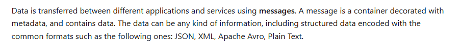

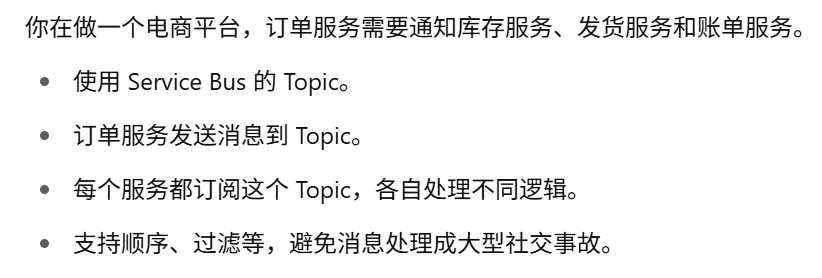

## Lab:

#### 1.创建Service bus namespace:

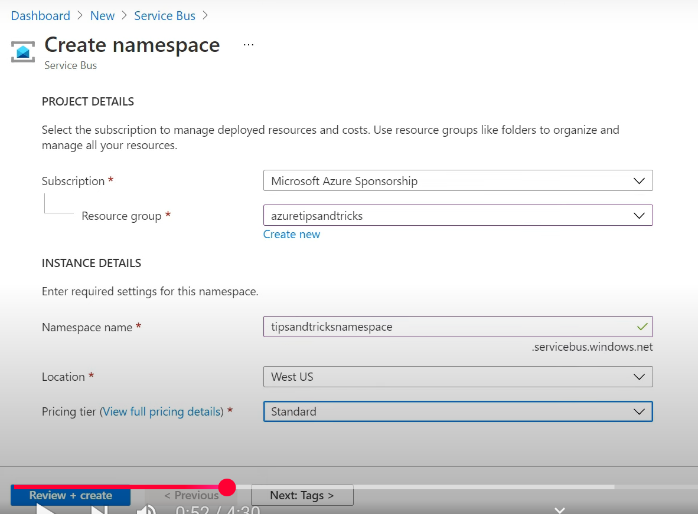

service bus namespace包含queues和topics：

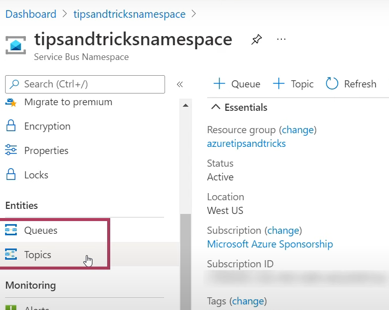

#### 2.创建Service bus topic:

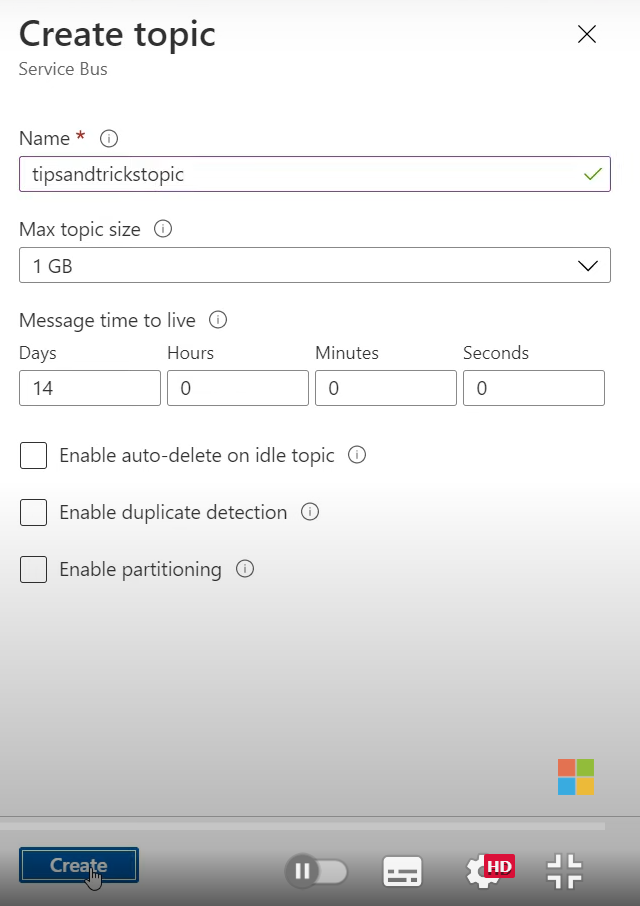

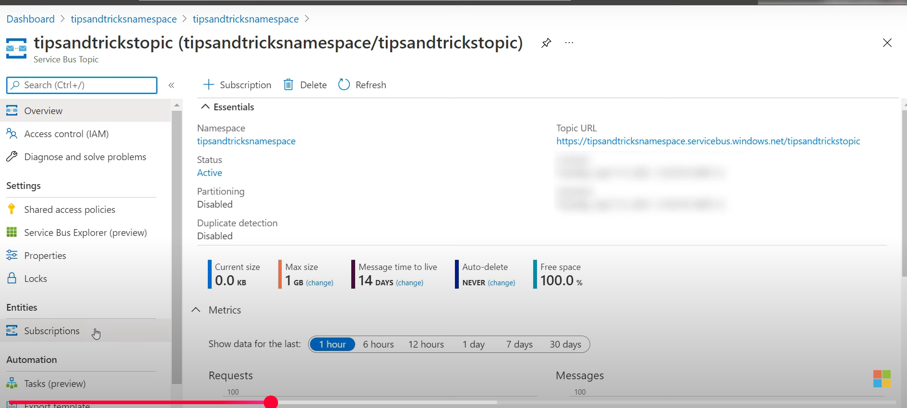

#### 3.在topic中创建subscriptions(一个topic可以包含多个订阅):

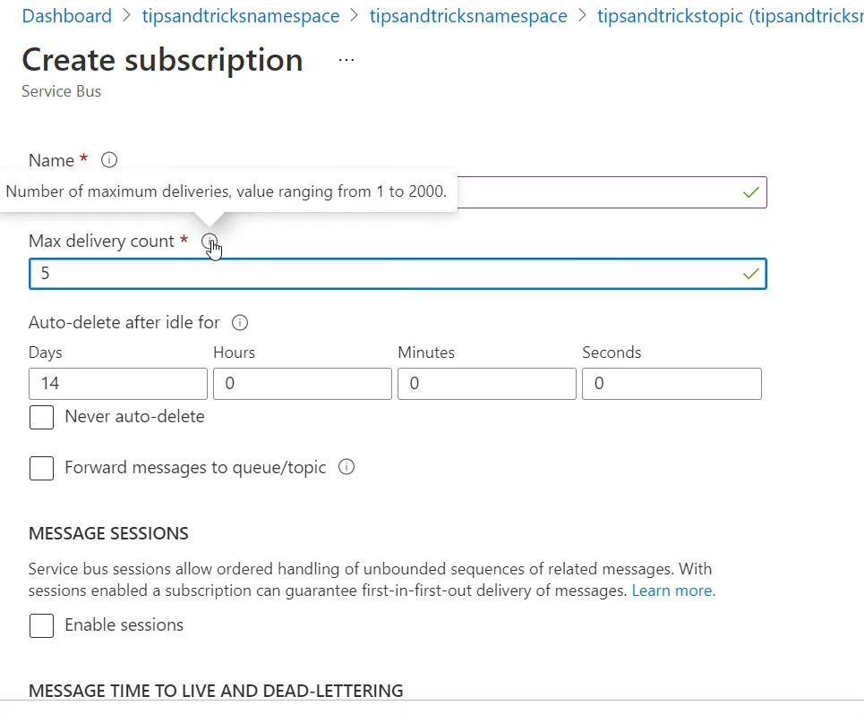

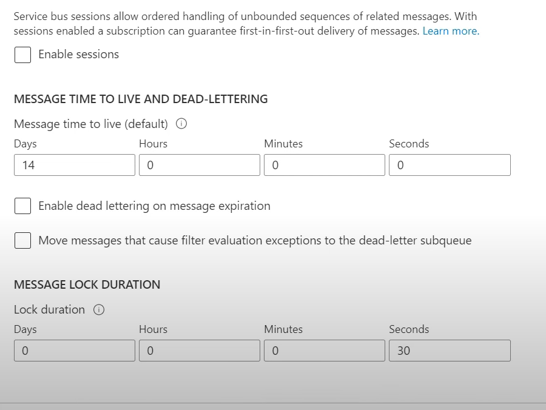

可以有多个订阅：

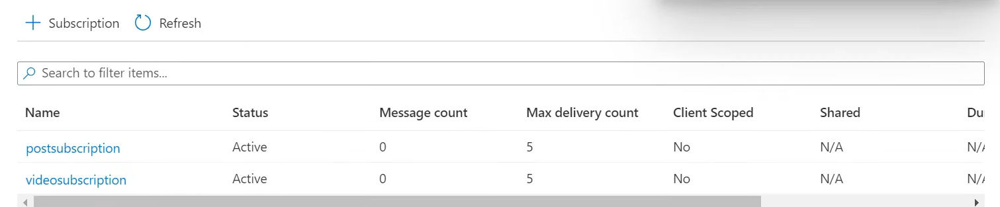

#### 4.在订阅中加filter过滤message：

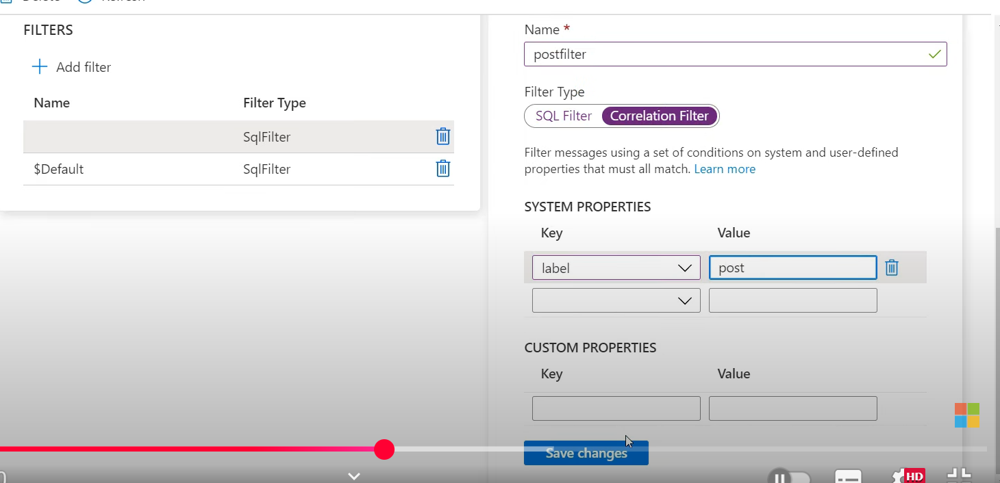

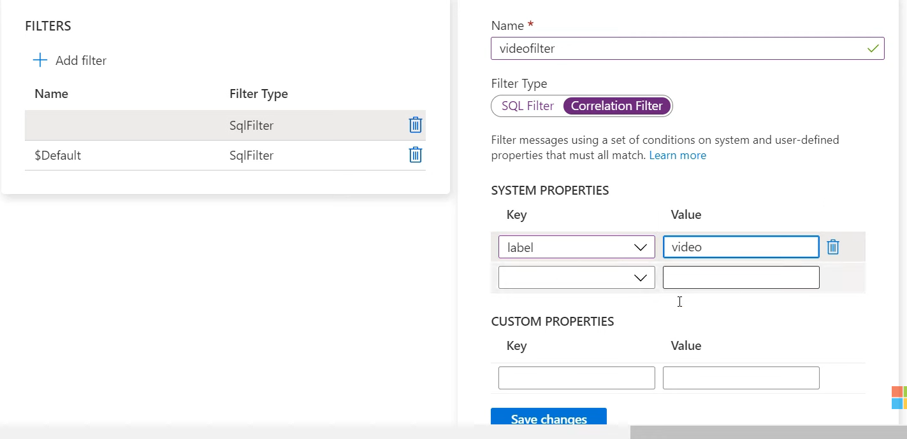

![alt text](image-34.png