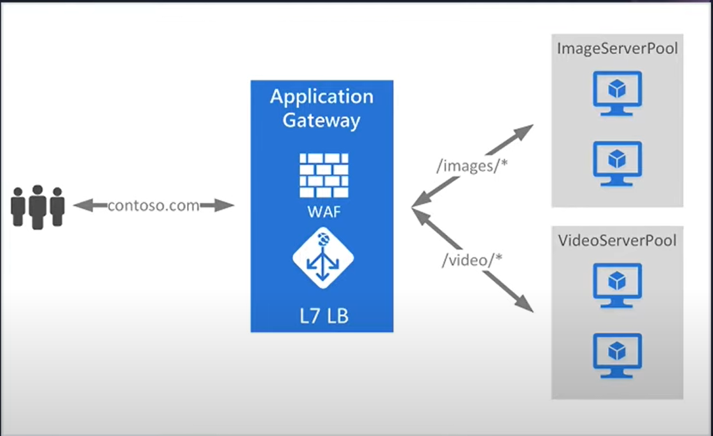
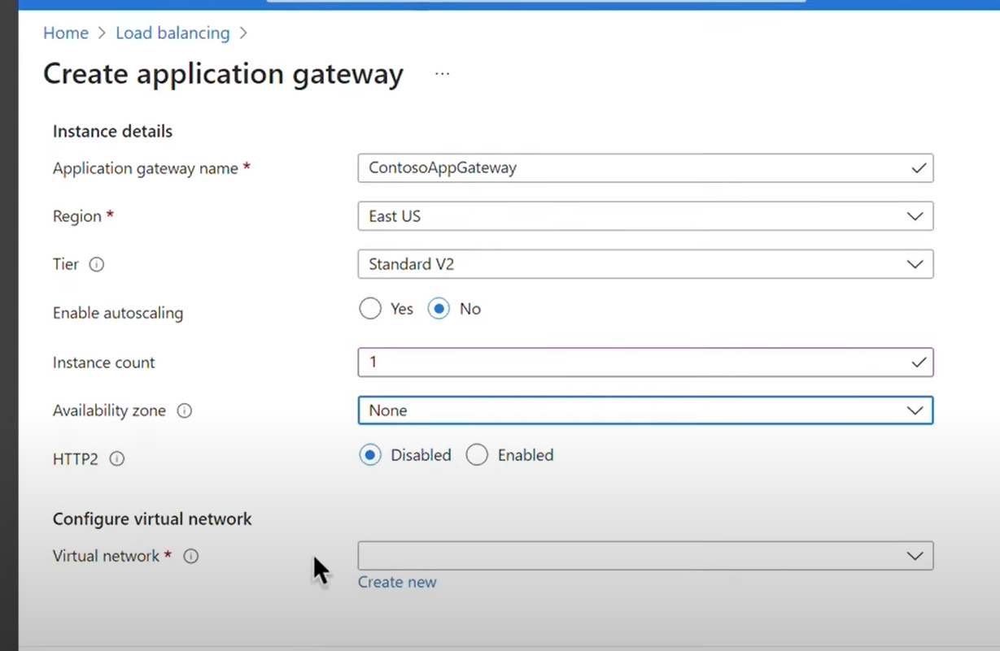
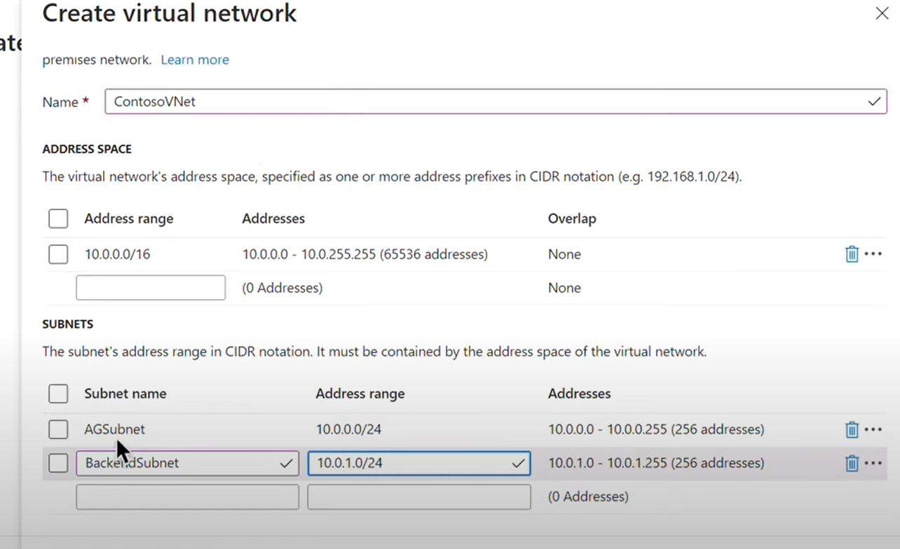
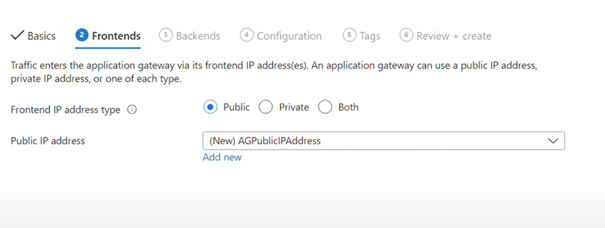
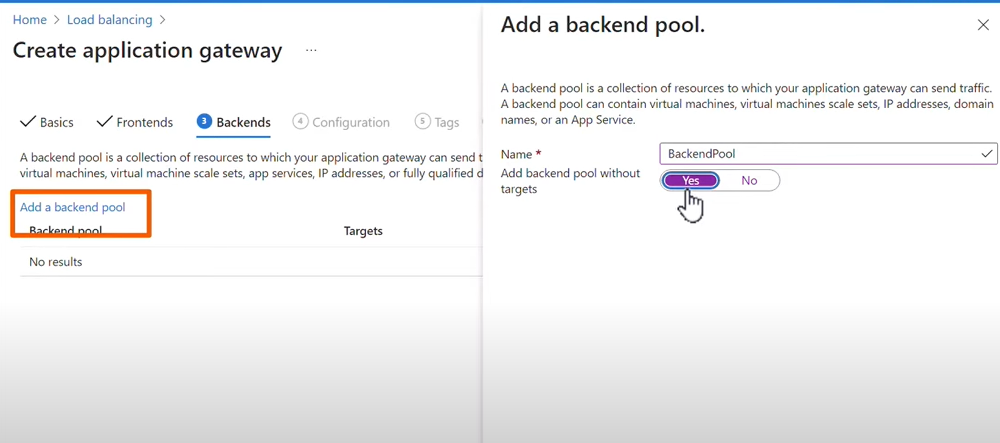
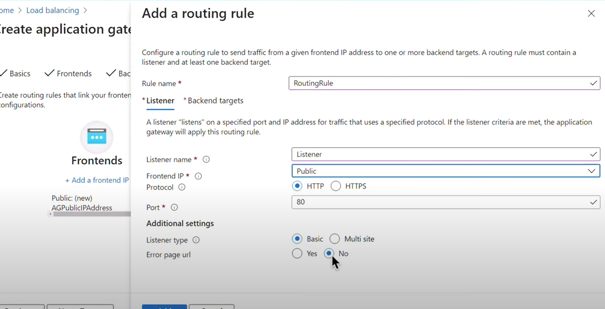
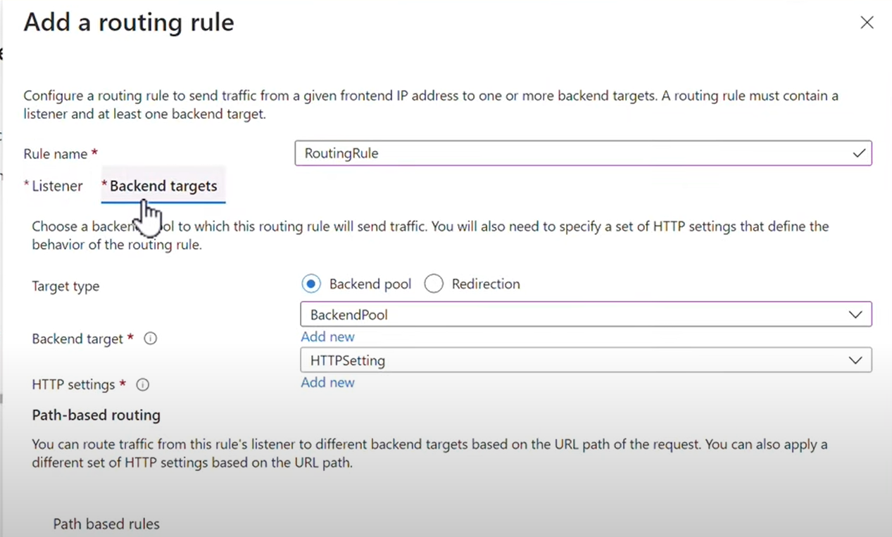
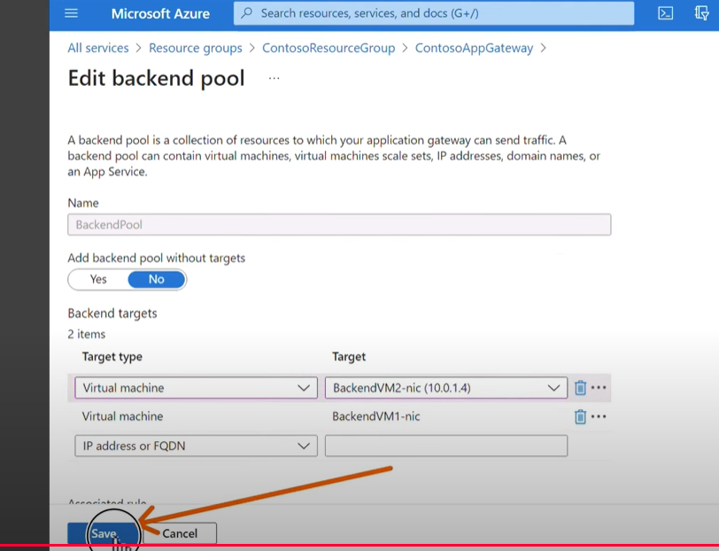

## Azure Application Gateway(Level 7)
- web traffic load balancer that enables you to manage traffic to your web applications.(仅限相同的azure region)

*概念图：*

1. **创建application gateway:**

    

    Network创建一个AG subnet和backend subnet：

    

    给application gateway创建一个frontend ip：
    
    

    未来可以创建backend pool：

    

    创建routing rule，创建一个listner监听http 80端口的流量：

    

    以及backend pool：

    

2. 将vm加入到backend pool：

    