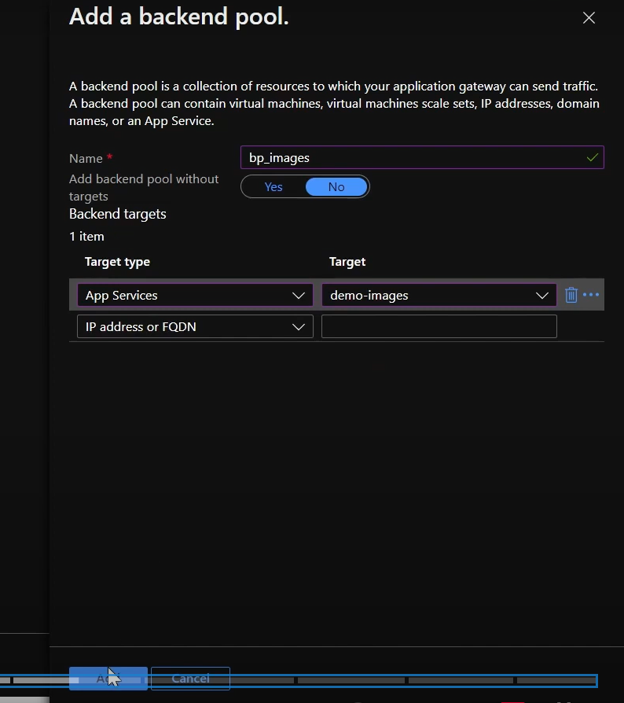
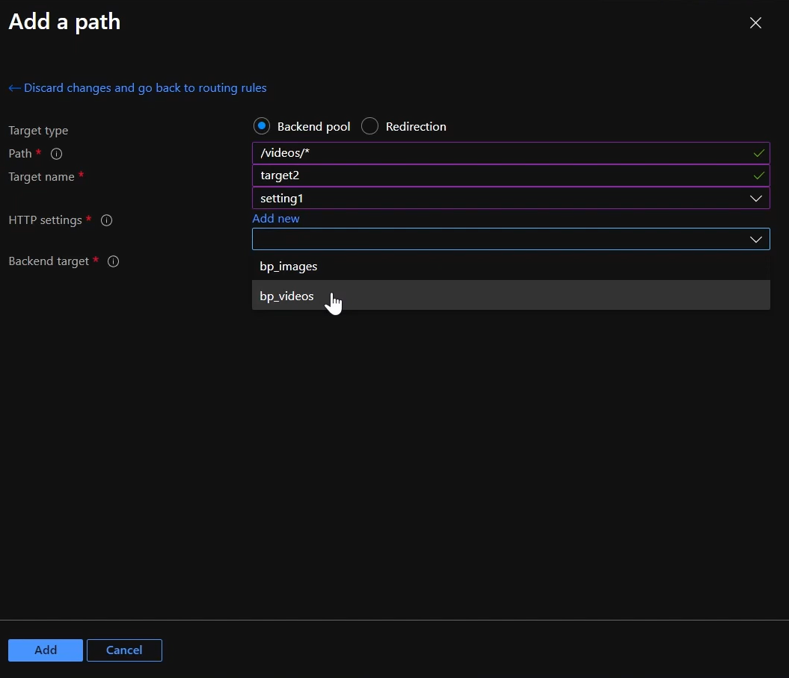

## Azure Application Gateway(Level 7)
- web traffic load balancer that enables you to manage traffic to your web applications.(仅限相同的azure region)

Web application firewall是其中一个feature

*概念图：*

1. **创建application gateway:**

    

    Network创建一个AG subnet和backend subnet：

    

    给application gateway创建一个frontend ip：
    
    

2. **添加backend pool：**
    将image和video app service加入到分别的两个backend pool中：

    

    

3. **创建routing rule：**
    创建routing rule，创建一个listner监听http 80端口的流量：

    

    以及设定backend targets：

    先创建一个http settings，target端口是80，request time-out是20秒等：

    

    使用这个http settings以及选择backend pool为images：

    

    设定Path-based routing(二级路由，原本默认是到images)，根据http request URL的路径去route到不同的backend pool:

    

    

    此时实现了以下：

    

4. Allow vnet of application gateway traffic to the app service:
    create a service endpoint of Microsoft.web in gateway network, make sure the traffic go through the Microsoft backbond network to app service:

    

    Allow traffic from gateway vnet to app service:

    
    
    But still we are getting a gateway error when reaching the IP of application gateway:

    

    Need to add a health probe:

    

5. Add a health probe:
    host是app service的URL：

    

    

    此时访问，还是收到error，invalid host name：

    

    去修改http setting配置，将override hostname改成yes，并自动选择beckend pool host的域名：

    

    此时，报错又发生改变：

    
    
    原因：

    
    
    把URL路径改完整，成功访问： 

    