## Azure Front door(Level 7)
- define, manage and monitor the global routing for your web traffic

Web application firewall是其中一个feature(可以限速)
https://learn.microsoft.com/en-us/azure/web-application-firewall/afds/waf-front-door-rate-limit-configure?pivots=portal
Lab:
## 1. Create two webapps(different regions)

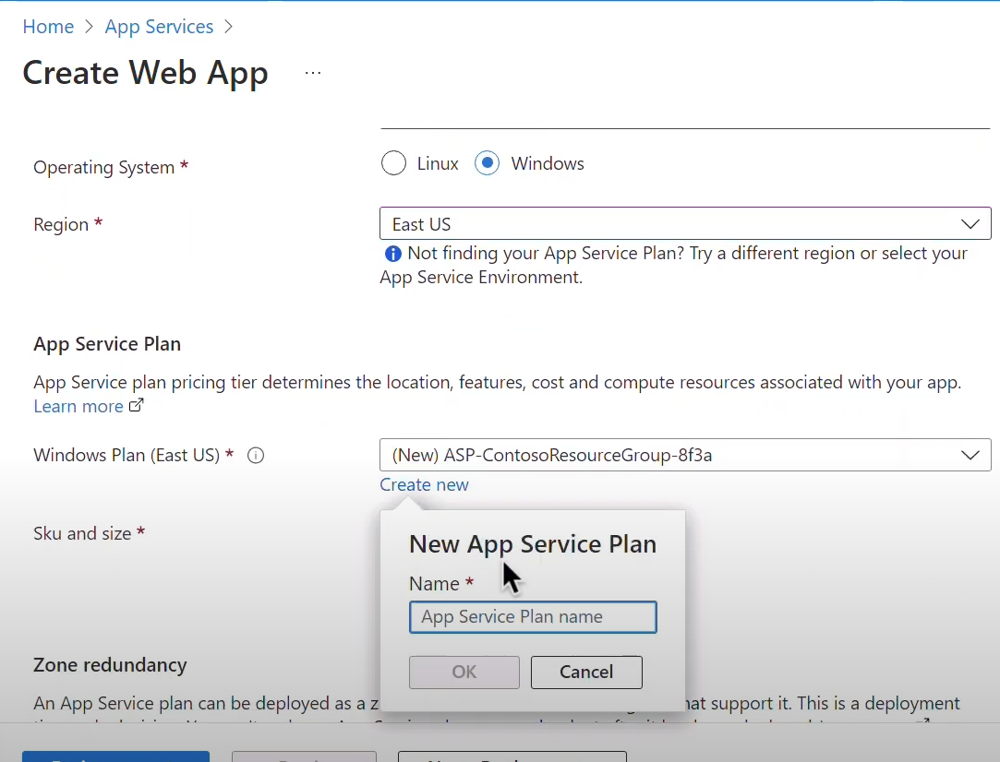

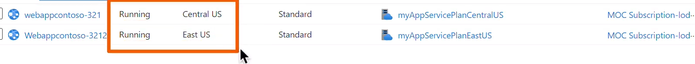

## 2. Create Azure front door.

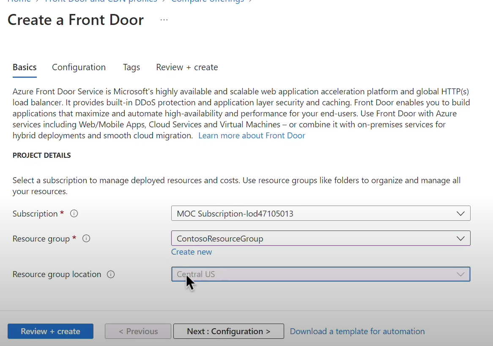

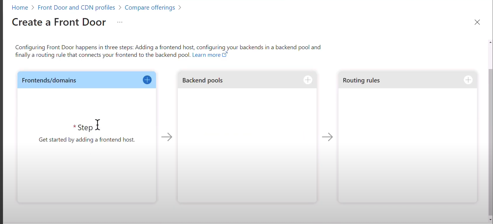

添加frontend host(front door),自定义域名

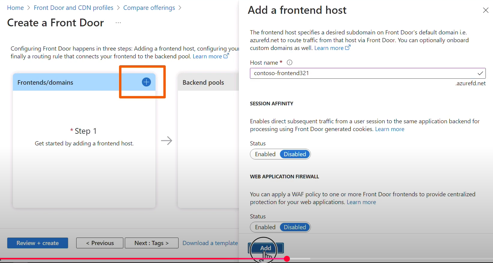

把创建的web app添加到backend：

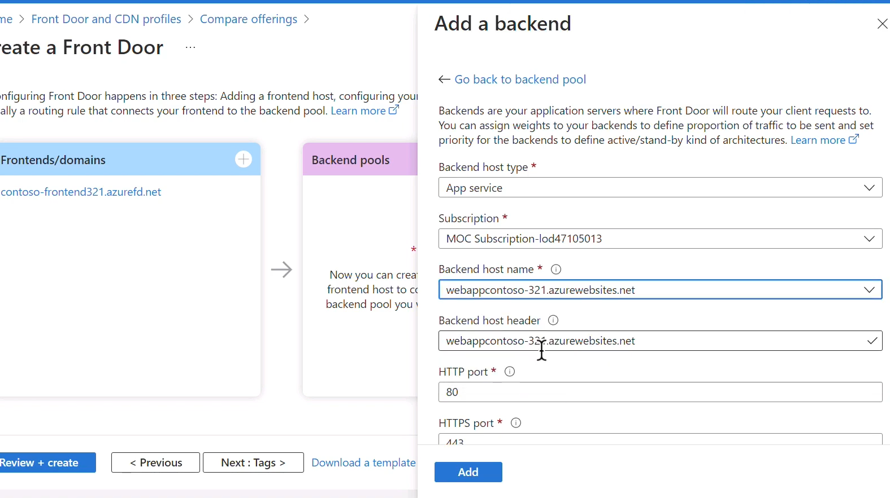

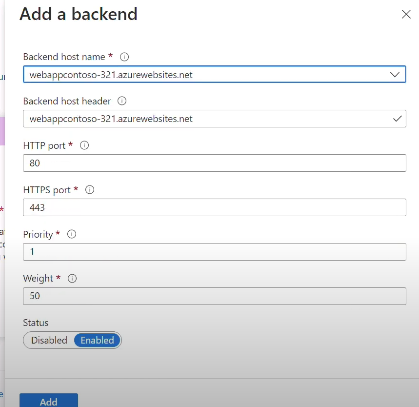

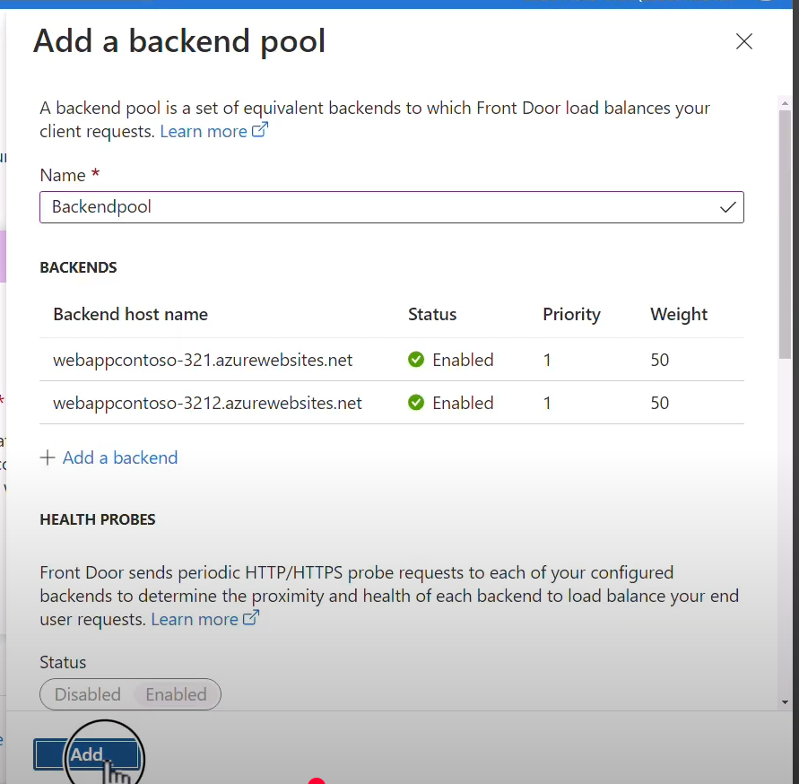

添加routing rule：

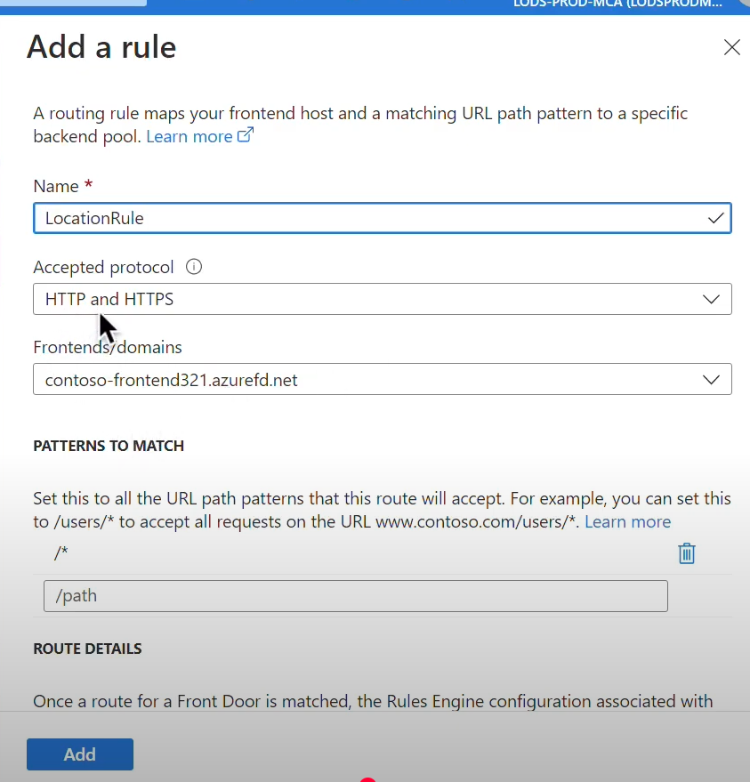

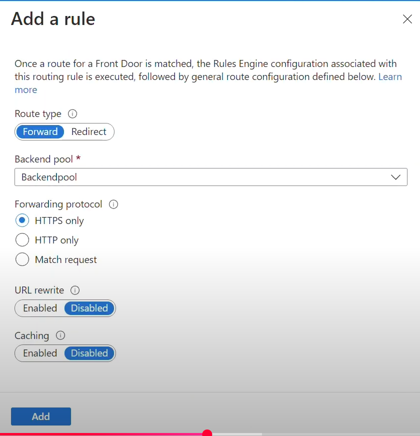

## 3. Test front door:

关掉一个webapp，front door会自动failover到另一个webapp

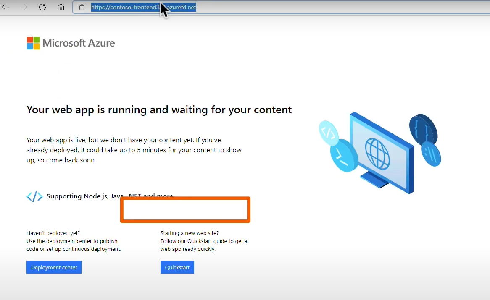