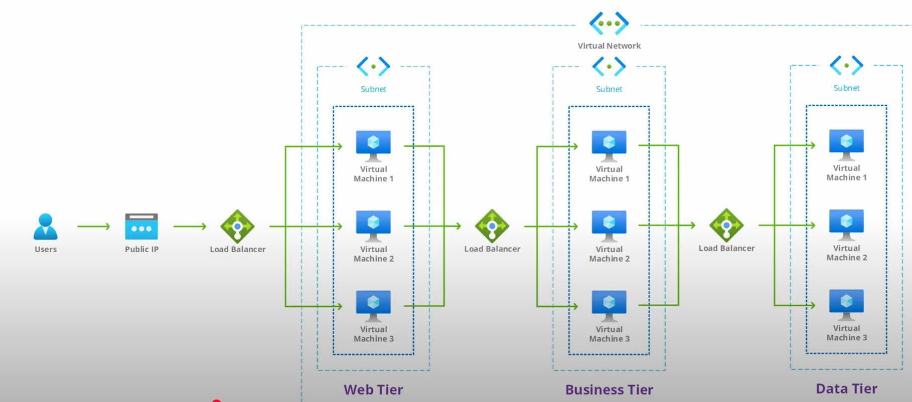

## Azure Load Balancer(Layer 4)
- provides high-performance, low-latency Layer 4 load-balancing for all UDP and TCP protocols

如果要连接第三方NVA,需要选择gateway load balancer(是一种特殊的azure load balancer的SKU)

## Overview:

## Terms:

## N-tier application:

## Two types of SKUs:

## Lab:

*Overiew project:*

1. Create three VMs in the same VNet:

    

2. Create load balancer:

    

3. Add VMs to backend pool:

    

4. Create health probe:

    

5. Create load balancer rule:

    

    