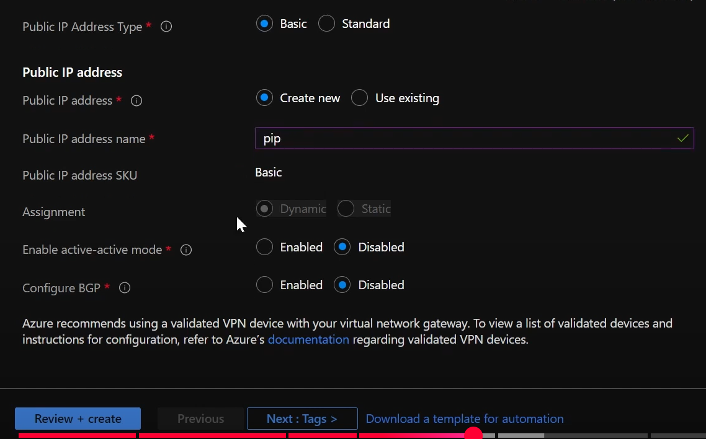
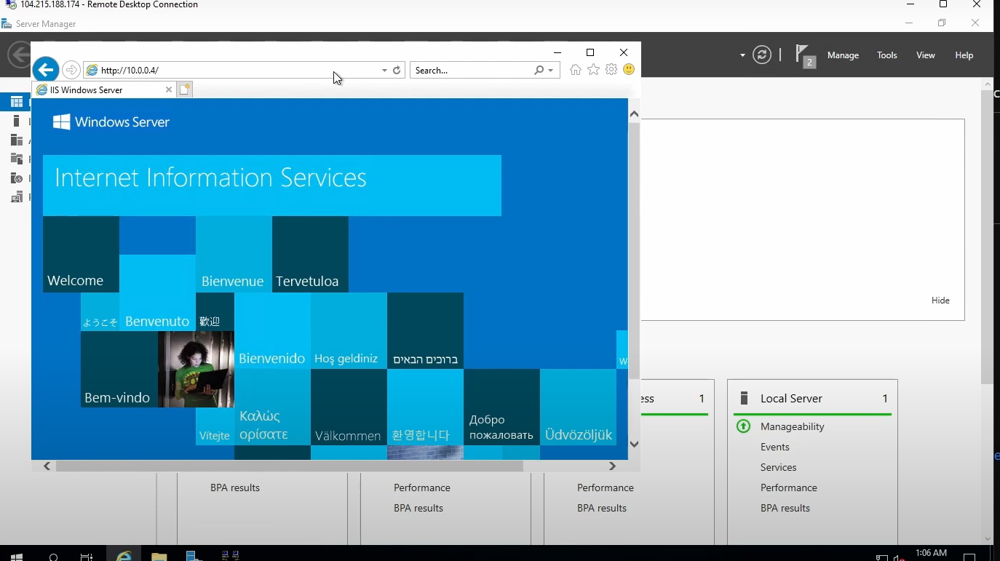

## Site-to-Site VPN
*Overview*

1. Use az CLI to create on-pre and cloud resources:

    

    

#### Pre-requistes for cloud:
1. Enable Web service for cloud server:

    为了让日后测试网络是否联通更加简单

    

    Web server works:

    

2. Create virtual network gateway:
    可以需要有一个单独的gateway subnet:

    

    需要有一个public IP:

    

#### Pre-requistes for on-premise:
1. Enable remote access(routing) service for on-premise server:
    让它变成一个local gateway device：

    

    deploy VPN only:

    

    Custom configuration:

    

    Demand-dial connections and LAN routing:

    

2. Create local network gateway:
    第一个ip是local gateway dedvice的ip(也就是前面的client VM的IP)，第二个网络段代表的是本地网络段

    

#### Set up the connection
1. Associate the local gateway to the cloud gateway:

    

    

2. Associate the cloud gateway to the local gateway:

    

    

    

    

    Paste the IP of the cloud gateway:

    

    

    Cloud IP address:

    
    
    keep empty for now:

    

    Enter the preshared key for connection:

    

#### Test
可以在本地网络直接用cloud VM的private IP访问，证明S2S VPN配置成功：

