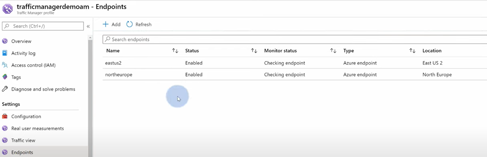

## Azure Traffic Manager(Level 4)
- DNS-based traffic load balancer that enables you to distribute traffic optimally to services across global Azure regions

## Routing methods
1. **Performance based method**:

    

2. **Weighted based method**:

    

3. **Geographical based method**:

    

4. **Priority based method**:

    

5. **Subnet based method**:

    

Lab:
**建立两个app和两个client vm分别坐落于North Europe和East US，用Traffic manager导流：**

*概念图如下：*

1. 创建Traffic manager，并且选择routing method：

    

2. 创建endpoints,连接到两个endpoints：

    

    

3. 分别用east us和north europe两台vm去测试，会发现基于performance based method会将clinet导入延迟更低的app：

    
    

4. Routing method可以更改：

    