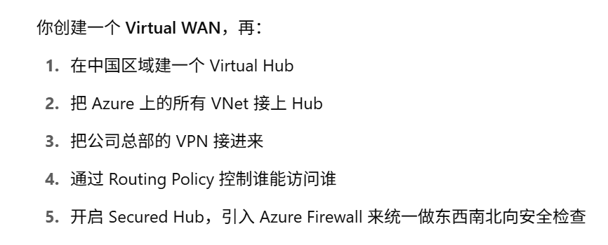

## Azure Virtual WAN

## Lab:

1. Create Wan:

    

    Overview page:

    

2. Create hub:

    address space should be unique from your on-premise network

    

    Virtual hub capacity:

    

    For S2S, P2S and express route, need to create a gateway before connect them to the hub:

    

    

    

3. Create viirtual network connections:

    add a virtual network

    

    

    You can add more vnets:

    