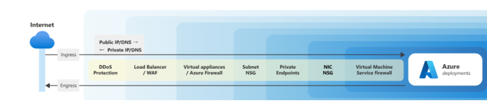
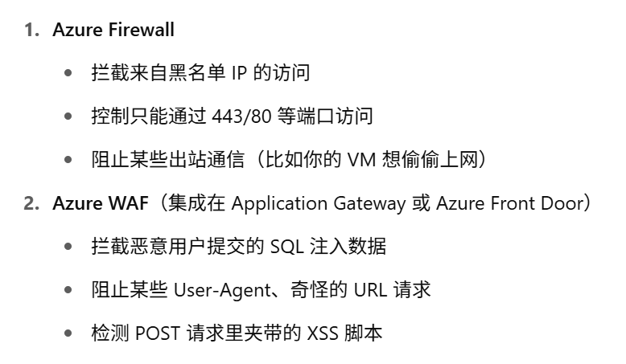

## Azure DDoS protetion

## Azure private link

- enables you to access Azure PaaS services (such as Azure Storage and SQL Database) and Azure hosted customer-owned/partner services over a private endpoint in your virtual network. 

## Azure Firewall

- Azure Firewall uses a static public IP address for your virtual network resources, which allows outside firewalls to identify traffic originating from your virtual network. 
- Azure Firewall provides inbound protection for non-HTTP/S protocols (such as RDP, SSH, and FTP), outbound network-level protection for all ports and protocols, and application-level protection for outbound HTTP/S.

## Azure Web Application Firewall
- L7 protect
- Configure customer-managed rules for extra protection based on source IP range and request attributes (headers, cookies, form data fields, query string parameters).

