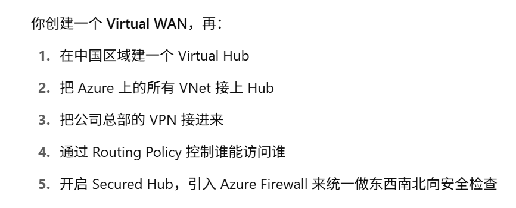

## Azure VPN gateway
- it sends encrypted traffic between an Azure virtual network and an on-premises location. 
- The encrypted traffic goes over the public internet.

## Azure ExpressRoute
- Use a non-microsoft connectivity provider.
- Connection between on-premise and Azure is prviate, traffic doesn't go through the internet.

## Azure Virtual WAN

