## Docker
- Docker 是一个用于构建(build)，运行(run)，传送(share)应用程序的平台
- 把需要的配置文件，启动命令，应用程序，环境变量，第三方软件库和依赖包，运行时环境和操作系统和各种依赖包打包成一个集装箱，以便在任何环境运行

## Docker和虚拟机的区别

*概念图*：

虚拟机：

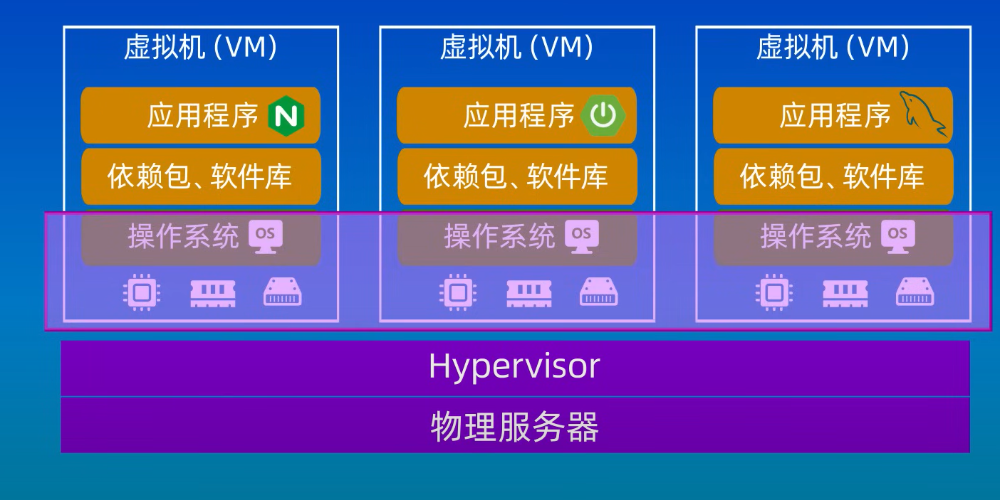

docker：

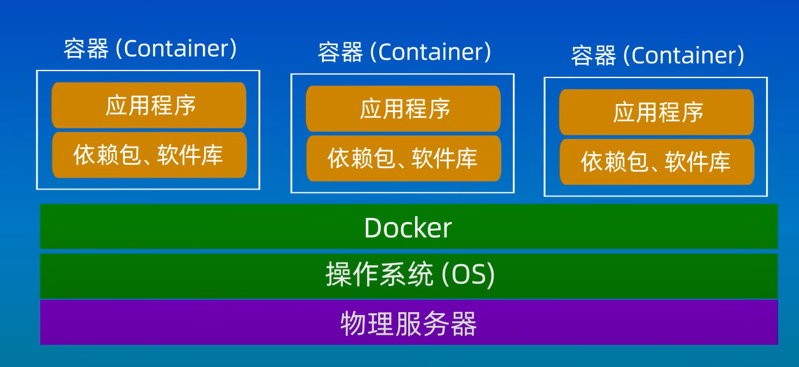

## Docker的基本原理和概念

1. Docker image:
    1. 可以用来创建container
    2. 只读模版
2. Docker Registry:
    1. 存储docker image的地方(比如dockerhub等)
3. Docker instance:
    1. 是docker的运行实例
    2. 提供了一个独立的可移植环境

## 容器化和dockerfile
容器化的步骤：
1. 创建dockerfile,docker file是一个包含一条条命令的文件，其中包含应用程序需要的依赖，配置环境和运行程序的所有内容，一般包括以下内容：
    1. 精简版操作系统比如Alpine
    2. 应用程序运行时环境比如NodeJS, Java, Phython等
    3. 应用程序比如SpringBoot打包好的jar包
    4. 应用程序第三方依赖库或者包，配置文件，环境变量等

    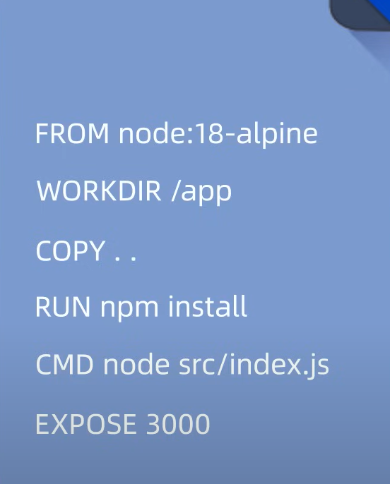

2. 使用dockerfile构建镜像
3. 使用镜像创建和运行容器

## Lab:

1. 编写dockerfile：
    1. 创建一个javascript文件，并写下一句话，在终端用node执行(nodeJS是一个运行时环境，可以让用户在浏览器以外的地方运行javascript的代码)：

        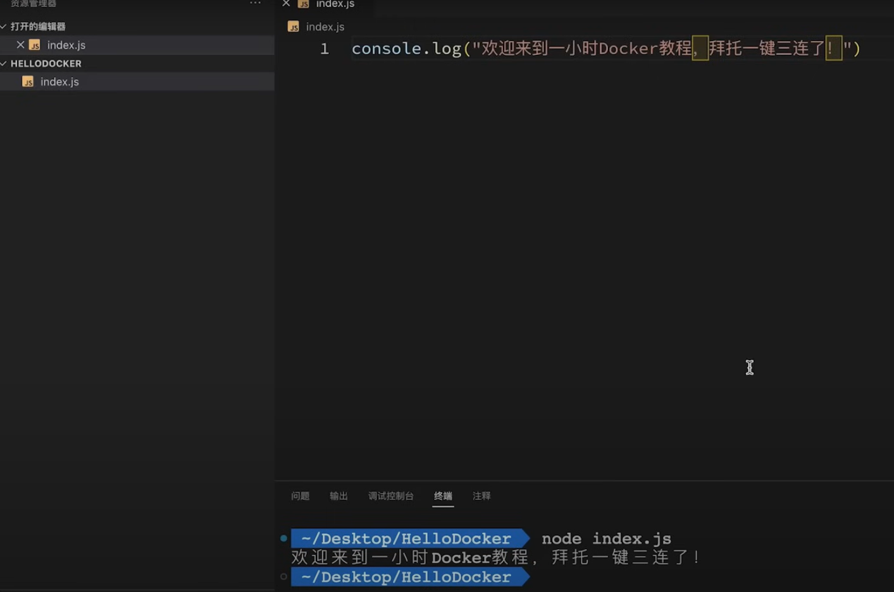

    2. 所以如果需要让另一个环境运行这个js文件，则需要以下条件：

        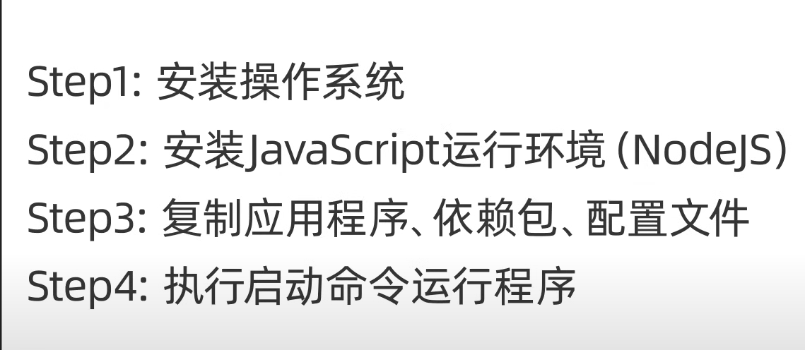

        我们则需要把这些所有东西写到dockerfile中

    3. 创建docker文件，dockerfile：
        1. 需要先指定一个基础镜像(极简操作系统):
            FROM alpine/FROM node:14-alpiine
        2. 使用copy命令复制文件：
            COPY source dest(源路径是指相对于dockerfile文件的路径，目标路径是相对于镜像文件的路径)
        3. 可以使用cmd运行程序：
            CMD ["可执行程序的名字"，"可执行程序接受的参数"]
            CMD 可执行程序的名字 可执行程序接受的参数

        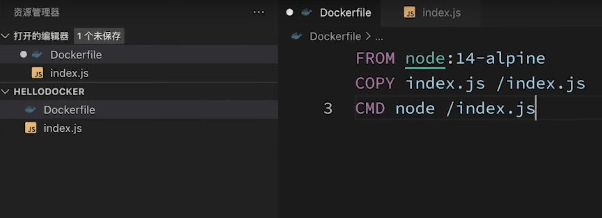

2. 创建docker image：
    1. 使用docker build去构建image：
        docker build -t [镜像名字] 【dockerfile文件位置】

        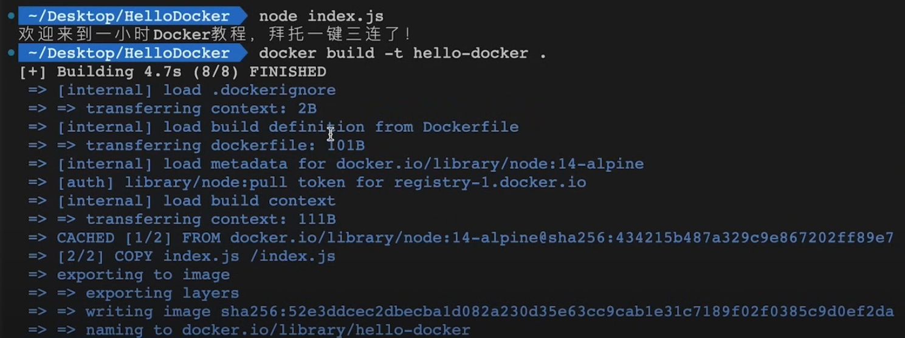

    2. 通过docker image ls/docker iamges来查看所有的镜像：

        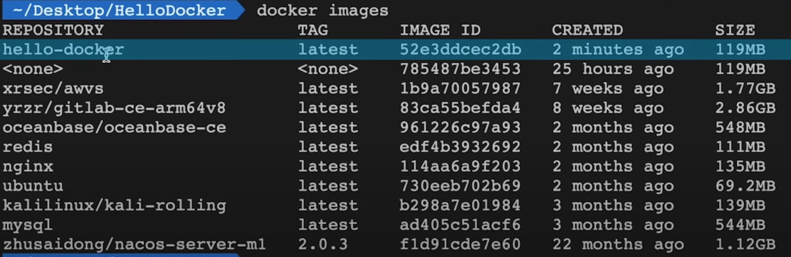

3. 运行docker images：
    1. 使用docker run运行镜像：
        docker run [镜像名字]

        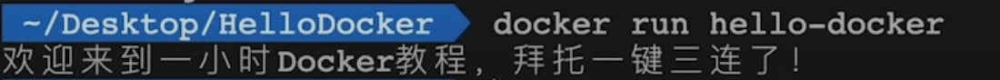

4. 从镜像仓库拉取docker image：
    1. 使用docker pull [Dockerhub上镜像的地址]：

        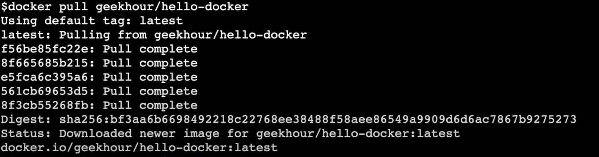

## Docker compose:
1. 用于定义和运行多容器docker应用程序的工具
2. 使用yaml文件来配置应用程序的服务
3. 一条命令可创建并启动所有服务

    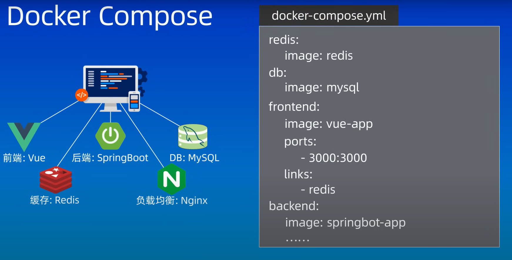