## kubectl
#### 查看资源命令
1. kubectl get <resources>:
    > get命令可以查看k8s中各种不同资源的状态：
    
    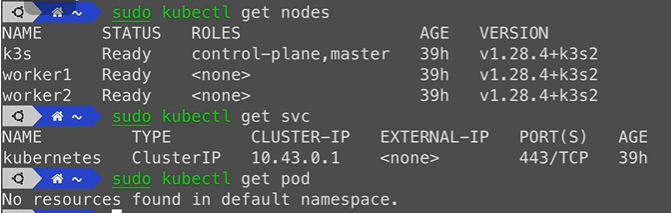

    > get all可以查看集群中所有资源：

    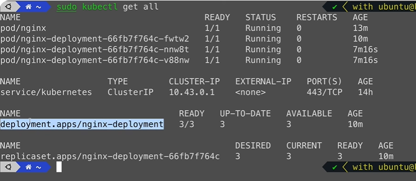

    > get <resources> -o wide可以查看pod跑在哪个ip和节点上

    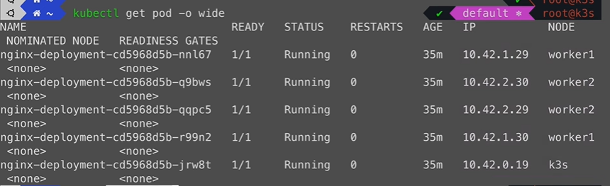

    > 然后可以curl接节点直接访问pod

    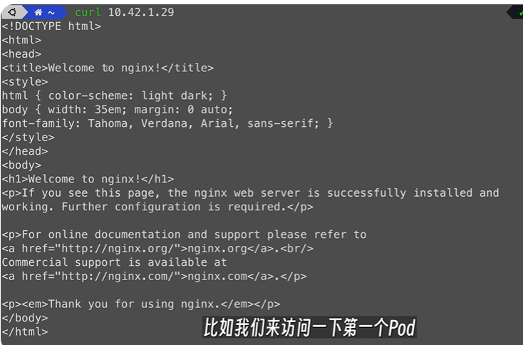

#### 创建资源命令
2. kubectl run <app name> --image=<name>
    > run命令可以通过镜像运行一个应用,kubernetes会默认使用从dockerhub中拉取镜像

    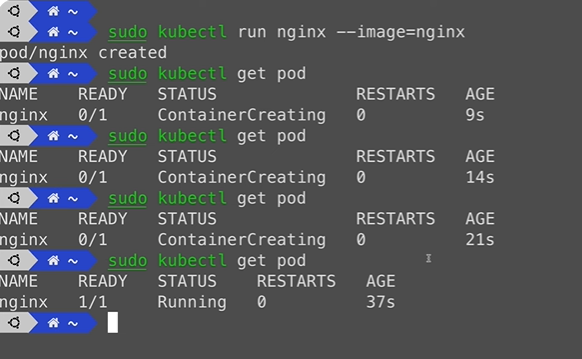

3. kubectl create <resources>:
    > create创建kubernetes中的资源，一般不会直接单独创建pod，而是创建pod的上层对象比如deployment等，会自动创建一个pod

    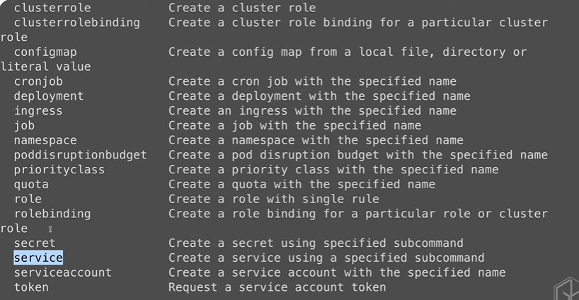

    比如创建一个deployment使用nginx镜像：

    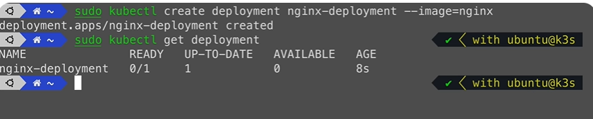

    也可以看到创建deployment之后会自动创建出来一个pod：

    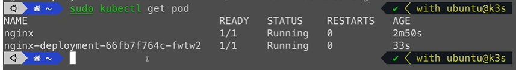

    deployment和Pod之间有一个中间件replicaset也会自动被创建:
    > replicaset管理pod的副本数量

    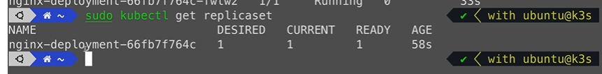

    *总结：deployment管理replicaset，replicaset管理pod*

#### 调试排查命令
4. kubectl logs <pod name>:
    > 查看日志

    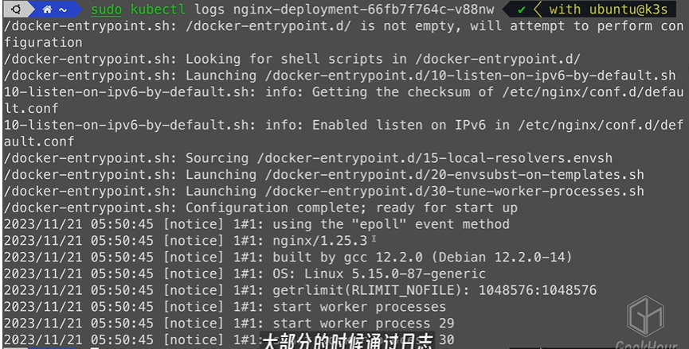

5. kubectl exec <pod name> -- <bash参数>:
    > 通过bash进入pod，再去执行命令
    进入pod中，可以通过ls，cat等命令去查看一些pod内部情况

    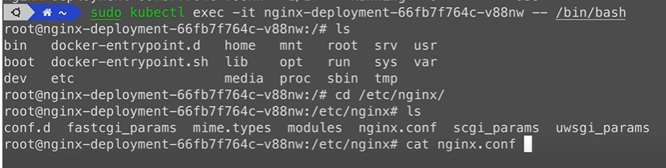

#### 删除资源命令
6. kubectl delete <资源类型> <资源名字>:

    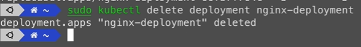
