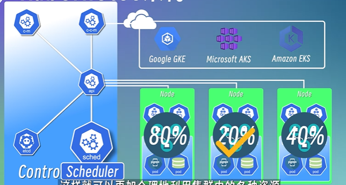

## Kubernetes architect
> Kubernetes通过将容器放入Node上运行的Pod中来执行你的工作负载
### Node(Worker Node)：
> 实际运行pod的节点
1. kubelet:
    1. 管理和维护每个节点上的pod
2. k-proxy:
    1. 为pod提供网络代理和负载均衡服务
    2. 多个节点通过service通信，k-proxy在每个节点上启动网络代理，使发送service的流量高效转发
3. container-runtime:
    1. 运行容器的软件
    2. 拉取容器镜像，创建容器，启动或者停止容器等
    3. 常见的容器运行时：

        

    

## Master node:
> 负责管理worker node
1. kube-apiserver：
    1. 所有组件都通过这个接口进行通信
    2. 用户可以通过如kubectl与api server进行通信
    
        

2. Scheduler：
    1. 监控集群中所有节点的资源使用情况
    2. 将pod调用到合适的节点上

        

3. Controller Manager:
    1. 负责管理集群中各种资源对象的状态，比如节点pod发生故障等
    2. 根据状态作出相应的响应,通过etcd去判断资源状态

4. etcd:
    1. 键值存储系统
    2. 比如某个pod挂掉，或者新的pod被创建，都会更新到etcd中

5. Cloud Controller Manager(云aks中的一个组件，帮助云aks与云上服务通信)