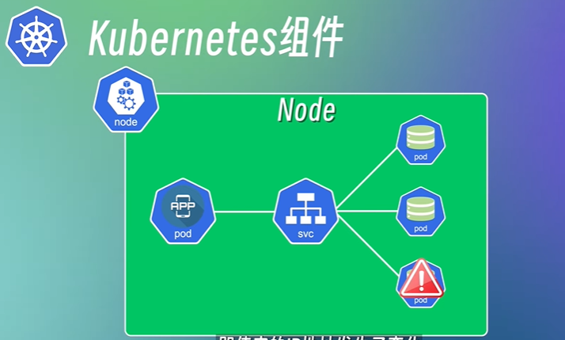
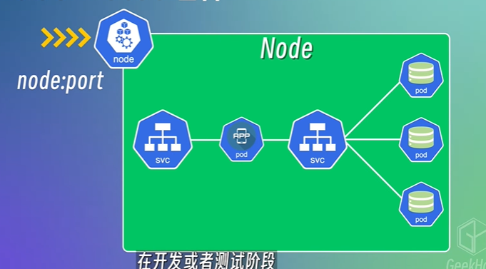
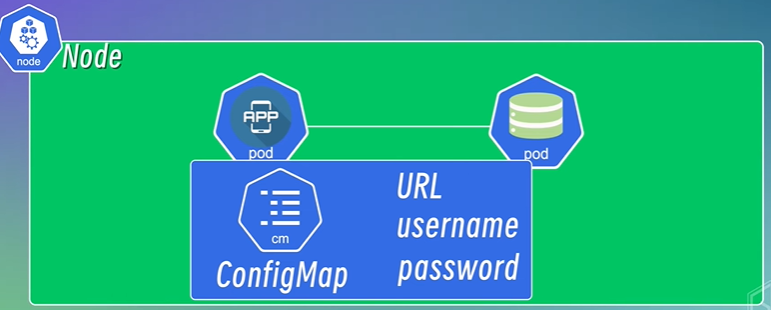
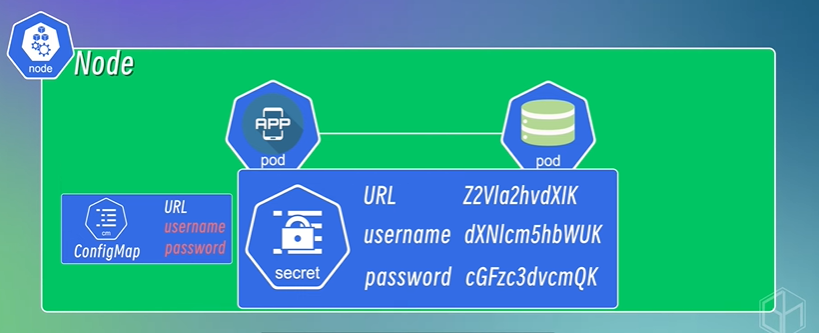
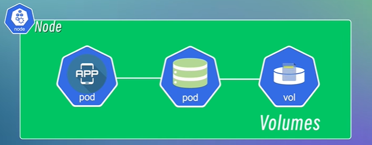
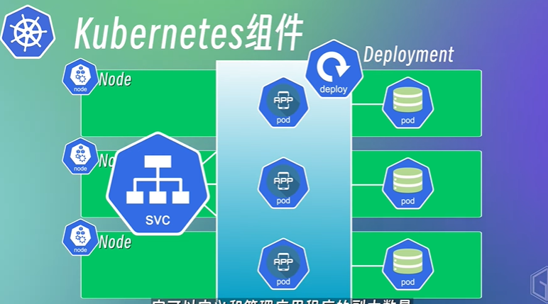

## Kubernetes
- 容器编排引擎，通过yaml配置文件来定义应用程序的部署方式，让容器的创建，维护和管理变得更加简单和高效。
- 提供容器高可用，比如自动重启，自动重建，自我修复等等。
- 提供可扩展性，系统根据负载的变化来动态的扩展或者缩减系统的资源。

## Kubernetes基础组件
1. Node(节点)：
- 有一个节点就是一个物理机或者虚拟机
2. Pod:
- 最小调度单元
- 一个或者多个容器的组合
- 建议一个pod只运行一个容器
- pod创建时会自动分配一个IP地址，pod之间通过ip地址来通信
- pod非常容易被销毁和创建，pod发生故障时可能会被销毁再重新创建，可能会被分配新的ip
3. svc(service):
- 将一组pod封装成一组服务
- 比如服务A可以通过svc的ip和svc背后的pod集群

    

## Kubernetes对外通信组件
4. node:port:
- 在节点上开放一个端口，将这个端口映射到svc的ip地址和端口，使服务可以对外开放

    

5. ingrerss:
- 配置不同的转发规则，根据不同的转发规则来访问集群内部不同的service以及service背后的pod
- 可以通过ingress设置域名
- 还可以配置负载均衡，SSL证书等功能

## Kubernetes程序沟通组件
6. ConfigMap:
- 将配置信息封装起来供应用程序读取和使用
- 当配置信息中的pod端口或者ip发生变化时，还需要修改configmap中的配置文件
- 配置信息都是明文

    

7. Secret：
- 和configmap类似，将信息封装起来供程序读取和使用
- 做了一层base64编码

    

## Kubernetes存储相关组件
8. volume：
- 因为pod被销毁后，数据也会消失，所以volume提供了将一些需要持久化存储的资源，挂载到本地磁盘或者远程存储

    

## Kubernetes高可用组件
9. Deployment:
- 定义管理程序的副本数量
- 程序的更新策略

    

10. StatefulSet:
- 和deployment非常相似，也定义和管理了应用程序的副本数量，动态扩缩容等功能
- 保证每个副本都有自己的存储和网络标识符，适合**有状态或者保留会话状态的应用**

