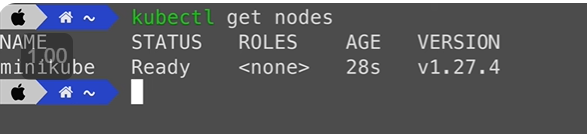

## 使用minikube搭建单节点kubernetes集群
> 在本地机器中的一个虚拟机运行
*以下使用MAC作为例子：*
1. 安装minikube到本地：
    minikube会自动安装kubectl

    

2. minikube常见命令：

    

3. 启动一个本地bubernetes集群：

    

4. 使用kubectl查看本地节点：
    可以看到刚刚启动的minikube节点

    

## 使用k3s搭建多节点kubernetes集群：
#### 先使用mutipass快速创建多个本地虚拟机VM：

*以下使用MAC作为例子：*
1. 安装multipass：

    

2.使用mutipass创建虚拟机：
*会默认使用ubuntu 22.04镜像*

    

#### 使用k3s继续安装：
1. 在mutipass创建出来的VM中安装k3s：

    

    可以看到这个节点已经变成一个master node:

    

2. 在master节点上获取一个token，是未来其他worker节点加入这个集群中的凭证：
    它保存在以下路径，可以直接用cat查看：

    

3. 接下来做以下操作，创建两个新的worker node并加入到集群中：

    

    登入到master node并查看节点信息：

    