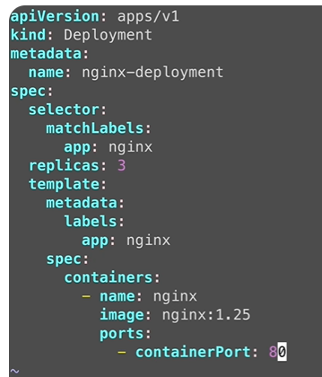
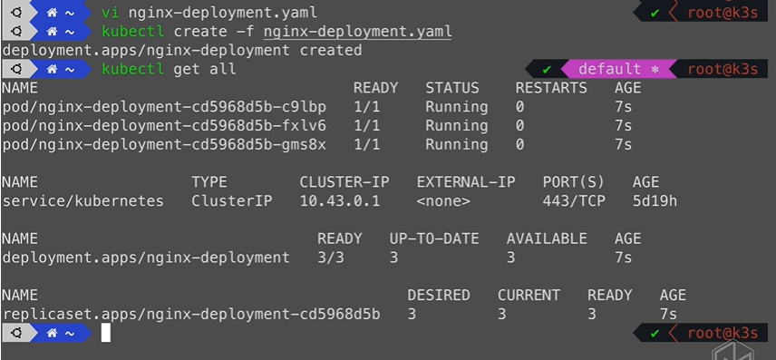
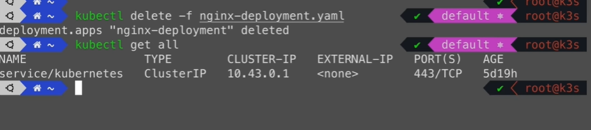
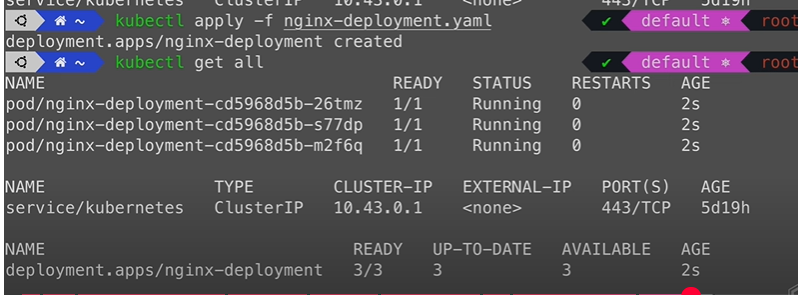

## Yaml
> 可以通过单独执行命令创建资源，但是在生产环境中不太现实，可以直接通过配置文件Yaml去实现高效创建资源
#### 创建配置文件：
1. 我要部署nginx，则先创建一个yaml文件：

    

    

    1. apiVersion：group/version
        1. group: 包含比如apps, batch, autoscaling(应用，批处理，自动扩缩等)
        2. version(比如某一个版本的配置项到另一个版本就不存在了，所以需要注意)
    2. kind(资源类型):
    比如service,deployment等等
    3. metadata(资源对象的元数据):
    名称，标签，命名空间等
    4. spec(specification规范):
        1. 定义资源对象的配置信息，包括多少副本，使用哪个镜像暴露那个端口等
        2. 它是一个嵌套结构，第一个spec定义的是deployment的，第二个spec定义的pod的

#### 通过配置文件创建或删除资源：
2. kubectl create -f <配置文件>

    

3. kubectl delete -f <配置文件>

    

4. kubectl apply -f <配置文件>
> apply通常是创建或更新资源对象，如果资源对象不存在，则会创建，如果存在，则会根据配置文件不同去做更新

    
