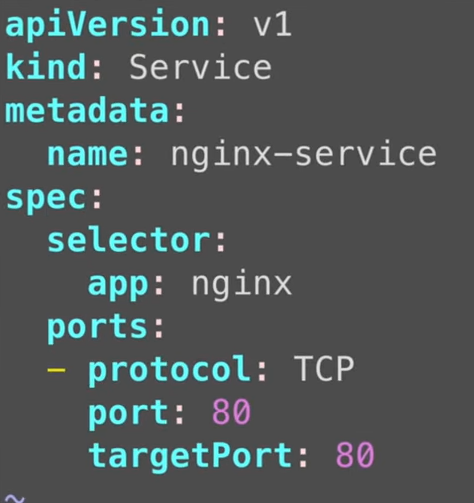
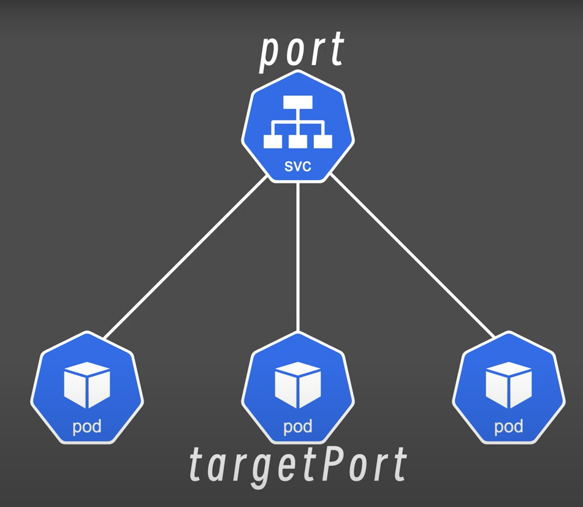
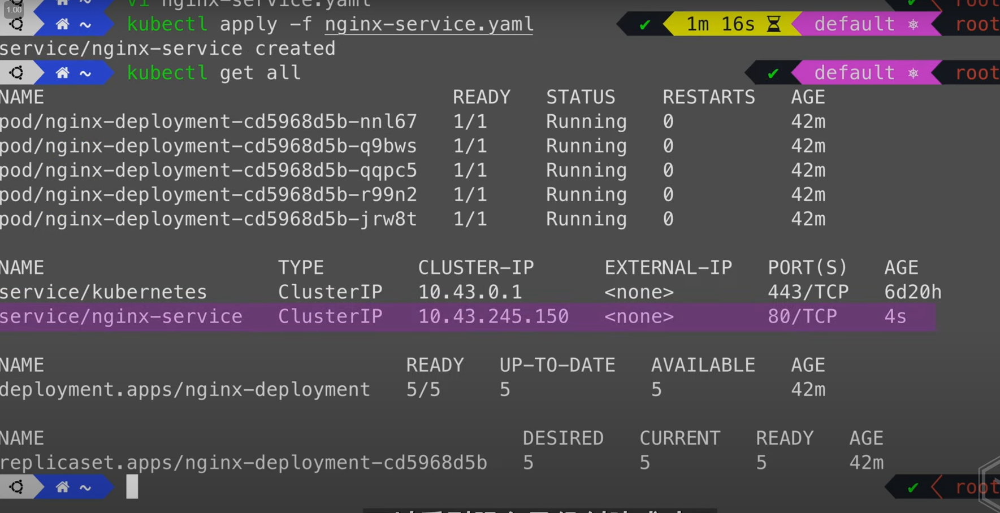
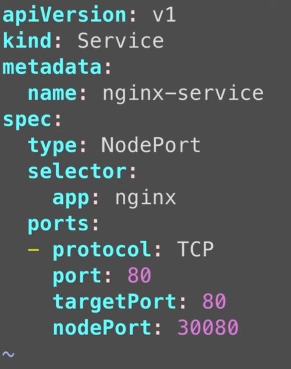
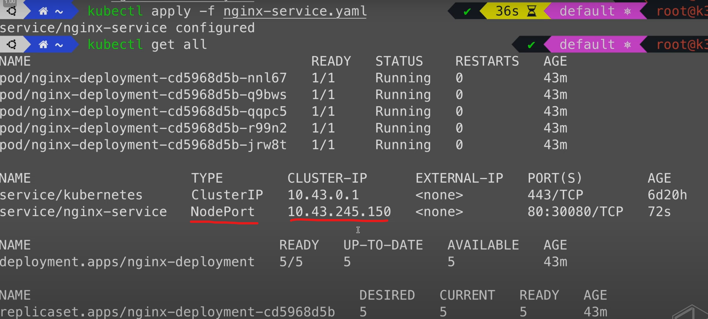
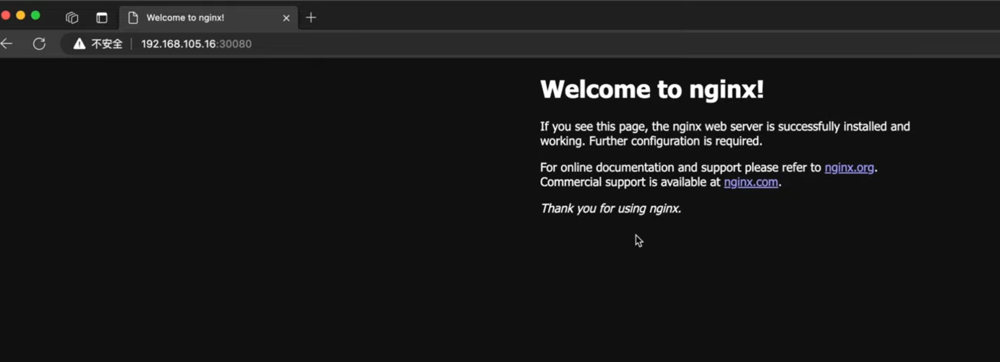
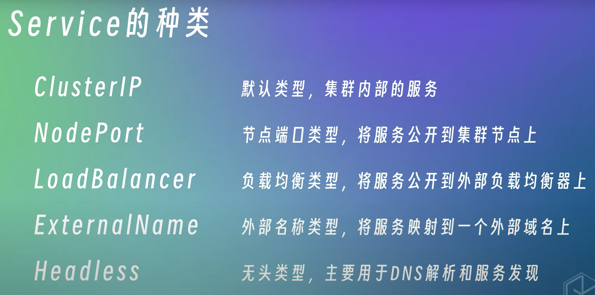

## Serivce
- 因为pod使用的是集群内部的IP，外部是无法访问到内部pod的IP，并且pod随时可能会被删除，重建，所以这时候可以使用service连接多个pod，并固定一个ip。

## 创建service：
> 可以用命令行kubectl create，但是更多都是用yaml创建
1. 创建一个yaml文件：
    

    

    
    
    1. apiVersion：group/version
        1. group: 包含比如apps, batch, autoscaling(应用，批处理，自动扩缩等)
        2. version(比如某一个版本的配置项到另一个版本就不存在了，所以需要注意)
    2. kind(资源类型):
    比如service,deployment等等
    3. metadata(资源对象的元数据):
    名称，标签，命名空间等
    4. spec(specification规范):
        1. selector: 用来选择特定的资源，比如nginx

2. 运行yaml文件并查看服务状态:

    

 ## 将service改成node:port类型
 > 此时service的ip任然是一个内部ip，依旧无法对法服务，之前没有加type，所以创建出来的service默认是一个cluster ip的服务
 1. 修改yaml配置文件：
    添加kind:node:port
    以及添加nodePort: 3xxxx(30000-32767之间)

    

2. 应用yaml并查看资源：
    此时服务已经变成node:port类型

    

    此时可以通过访问节点ip:nodeport访问背后的服务：

    

    