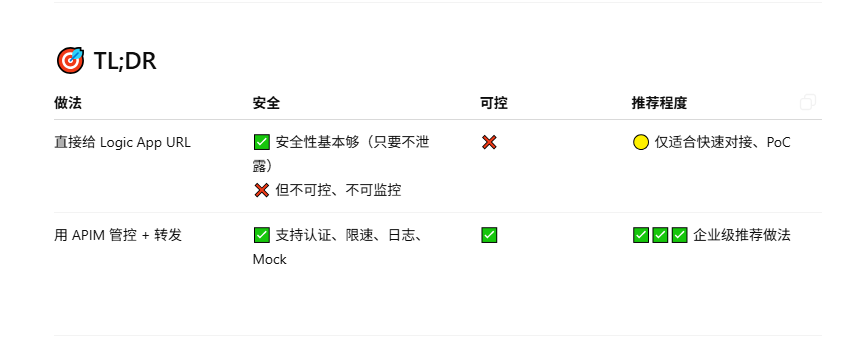

57页：
---

## ✅ 步骤详解

### ① 创建 API Management 实例

1. 登录 [Azure Portal](https://portal.azure.com/)
2. 搜索并创建 `API Management`
3. 选择资源组、名称、Developer SKU（测试足够）
4. 部署大概 10 分钟

---

### ② 把 Logic App 加入 APIM

1. 打开 APIM 实例 → `APIs` → `+ Add API` → 选择 `Blank API`
2. 配置如下：

| 字段 | 值 |
|------|----|
| Display Name | SubmitOrder |
| Name | submitorder |
| Web service URL | 粘贴你的 Logic App HTTP POST URL（包含 `sig=`） |
| API URL suffix | orders |
| Products | 勾选 Unlimited（或你自己新建的 Product） |

---

### ③ 添加操作（Operation）

1. 进入 `SubmitOrder` API → `+ Add Operation`
2. 配置如下：

| 字段 | 值 |
|------|----|
| Display Name | Create Order |
| Method | POST |
| URL | /submit |
| Description | 提交订单数据给 Logic App |
| Forward Request | ✅ 勾选 |

---

### ④ 添加限速策略（Rate Limit）

进入 Operation 的 `Design` 或 `Code View`，在 `<inbound>` 下加入：

```xml
<rate-limit calls="10" renewal-period="60" />
```
表示每分钟最多十个请求

### 获取API入口地址

最终调用地址：
```arduino
https://your-apim-name.azure-api.net/orders/submit
```

这就是 Fabrikam 调用用的网关地址，代替你原来的 Logic App URL。

直接用logic app和使用API management的区别：

