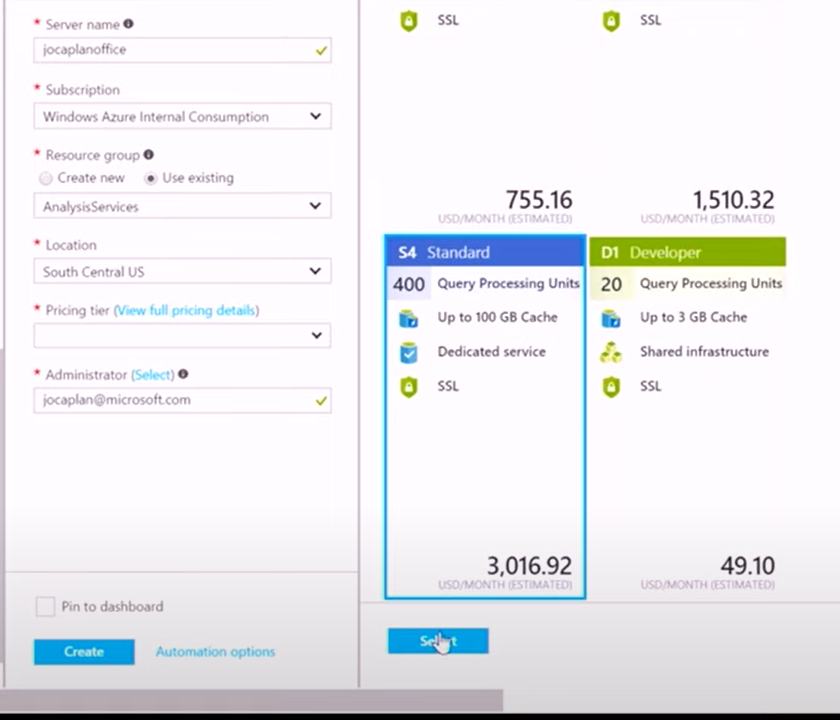
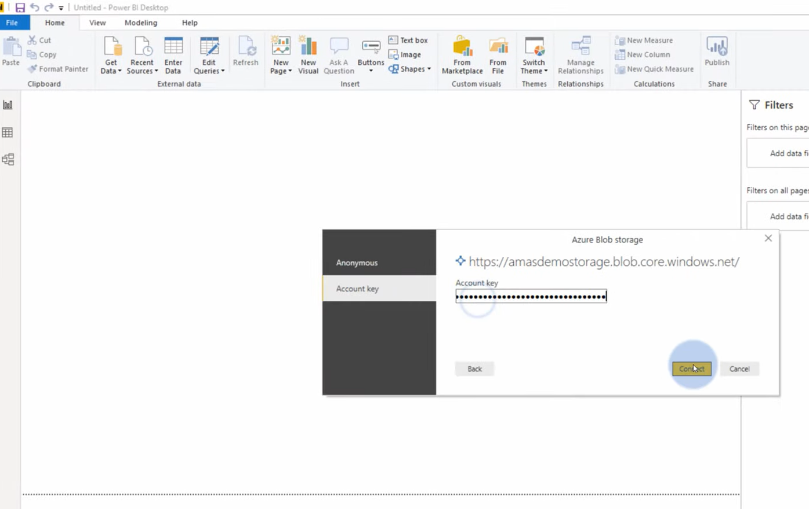
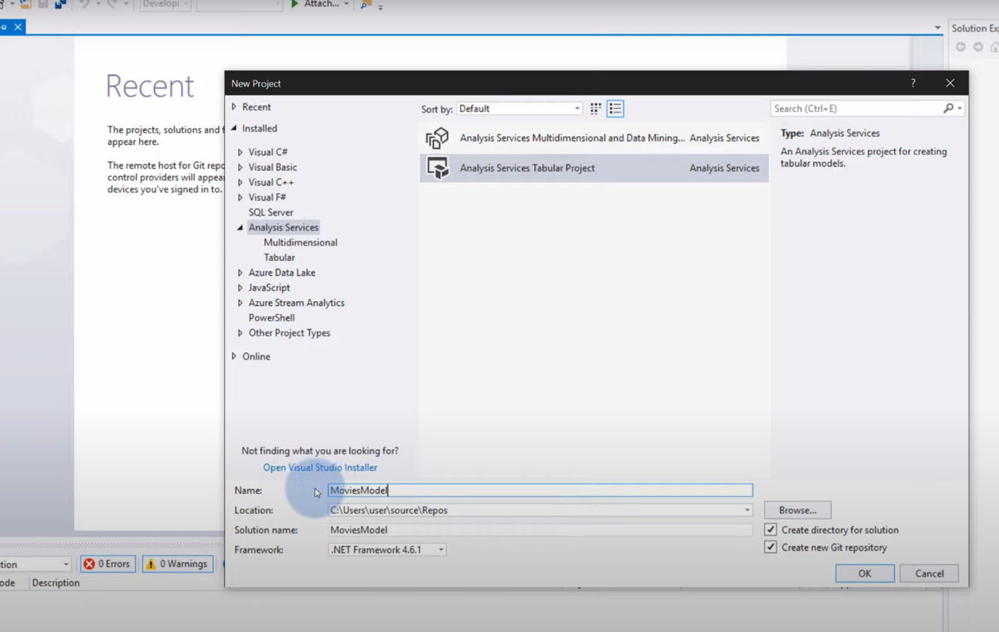
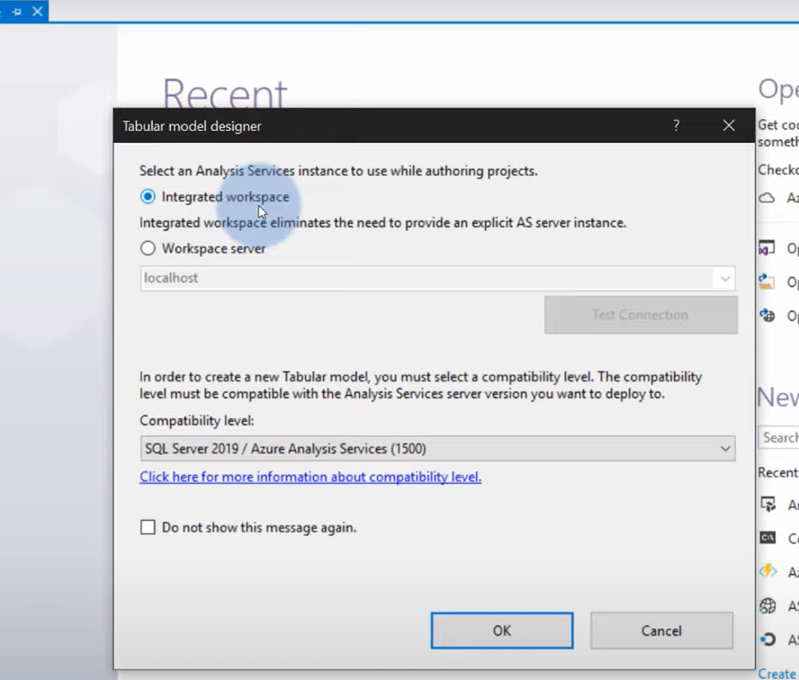
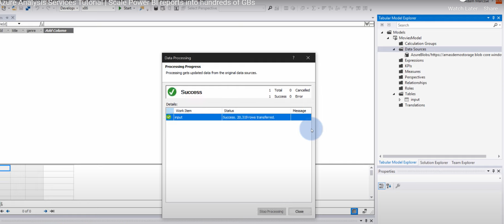
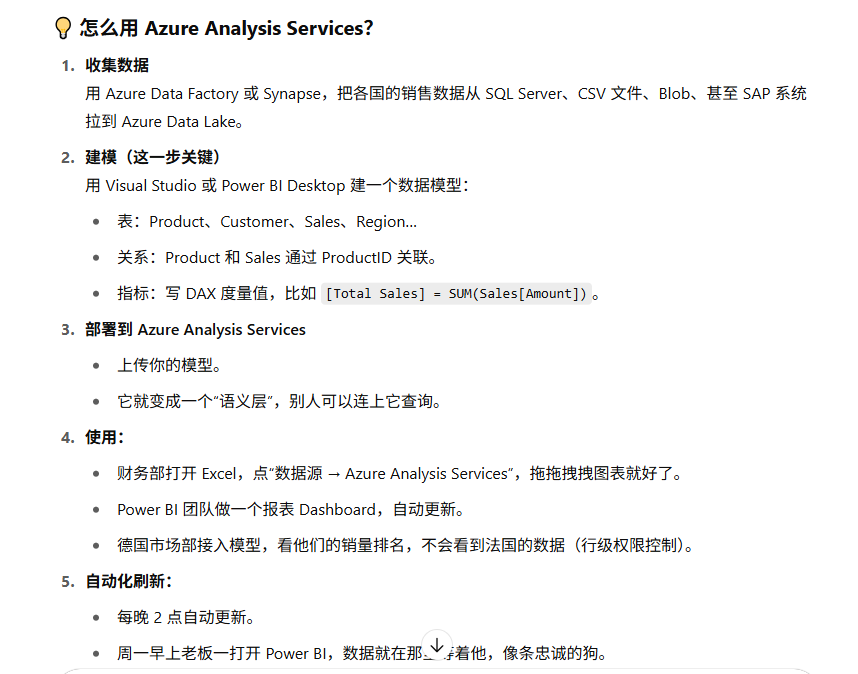

Demo: storage account → Analysis Services → Power BI

## 1. Create Analysis Services:

    

## Insert data from blob to Power BI:

## Create Analysis services tabular project in Power BI:

## import data to the project:

