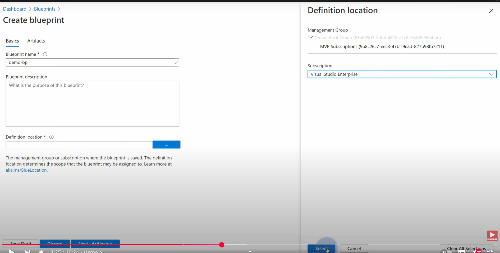
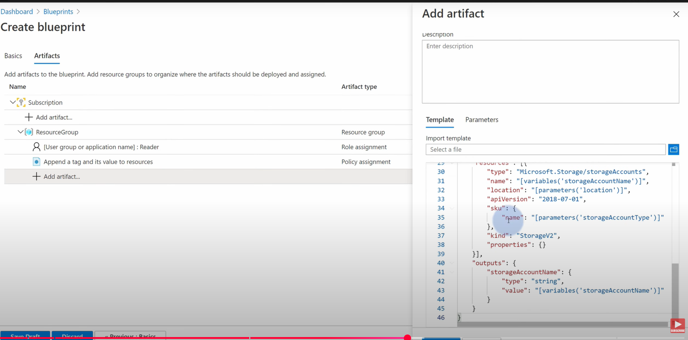
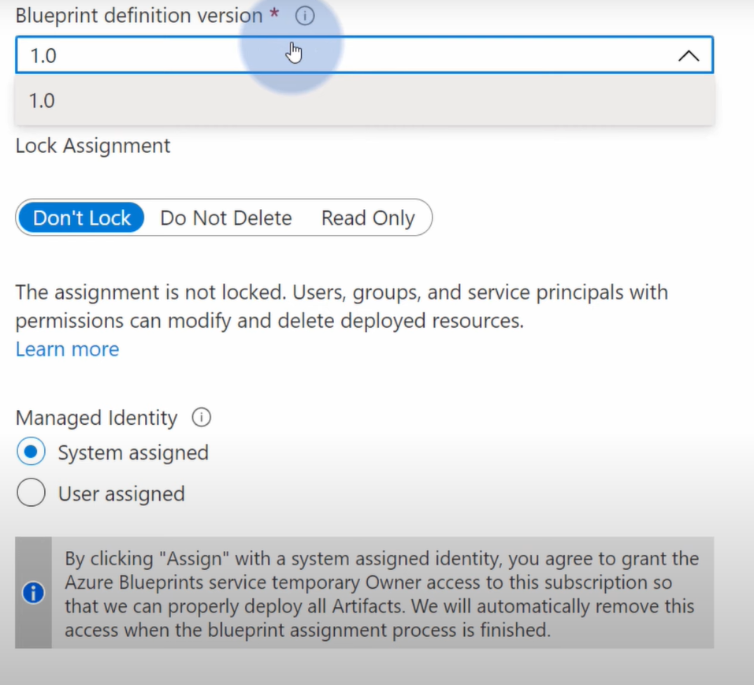
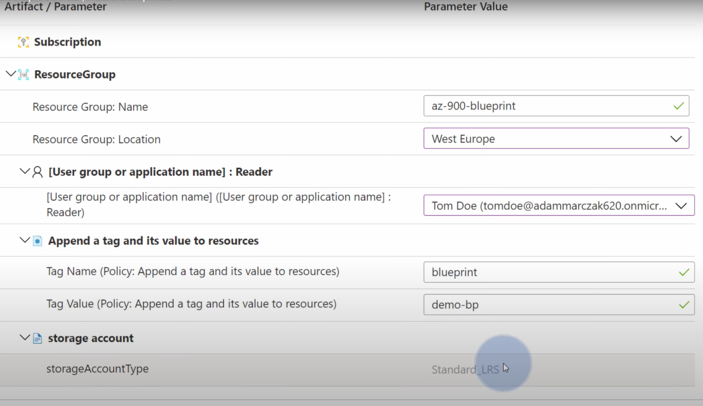
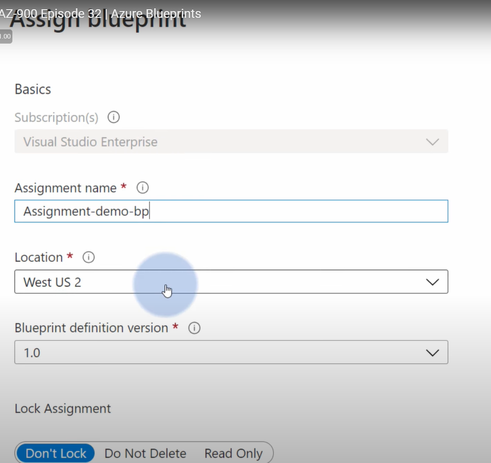

70 页

## 🔁 Blueprint 实际部署步骤（简化流程）

1. 在 Azure Portal，进入 **East tenant**，创建一个 Management Group（如 `EastApps`）

2. 在该 Management Group 下：
   - 创建一个 **Blueprint Definition**

        

        可以是定义management group level或者是subscription level

   - 定义包含以下资源：
     - 一个资源组（Resource Group）
     - 一个 Azure Web App
     - 一个 Azure Cosmos DB 账户
     - 自定义角色分配（Custom RBAC）

        

        

        

3. 将该 Blueprint 分别 **Assign（分配）给 Sub1 和 Sub2**

    

4. 然后切换到 **West tenant**，重复相同步骤：
   - 创建 Management Group（如 `WestApps`）
   - 定义一个相同的 Blueprint
   - 分别 Assign 到 Sub3 和 Sub4

📌 **注意事项：**
- Blueprint Definition 和 Assignment 都不能跨 Azure AD tenant
- 每个 subscription 必须单独做一次 assignment
