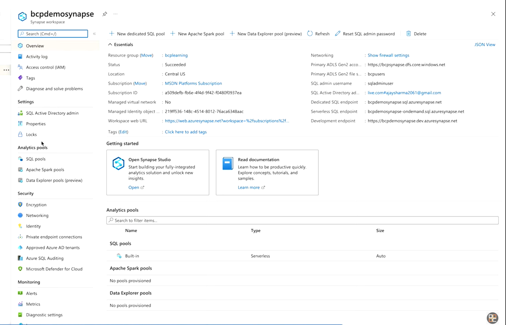
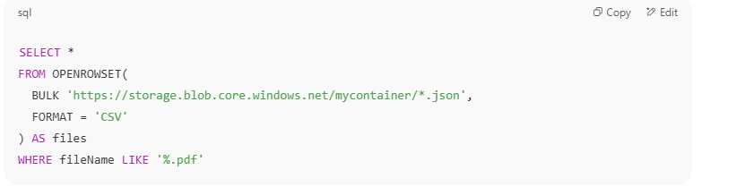

Synapse 是一个统一的数据分析平台，结合数据集成、数据仓库、大数据处理、实时查询和机器学习于一身。

## 1. Create azure synapse analytics workspace

    [alt text](image-22.png)

    Overview page of Azure synapse analytics workspace:

    

## 2. 可以在workspace中用sql语句分析数据

    