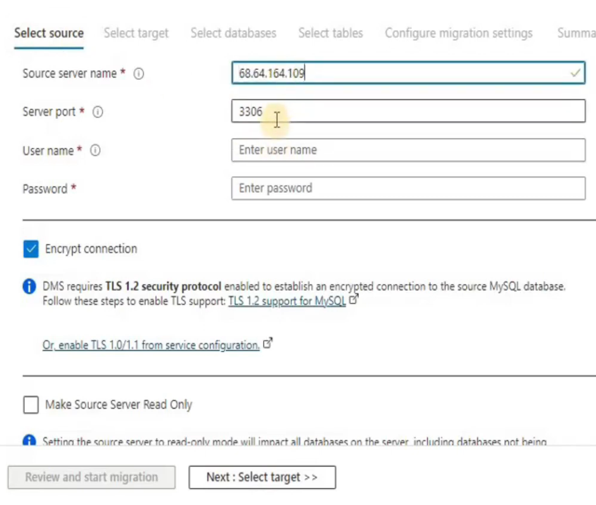

## Data migration service

## Lab:

1. Create Azure MySQL database:

    

2. Create Azure database migration service:

    Select source server type:

    

    

    

    

3. Need to download integration runtime for source on-premise database:

    

    

    

4. Create a new migration project:

    

    Fill out the source server information:

    

    Select target db:

    

    Select database needed to be migrated:

    

    Select table:

    
    
    Started to migrate:

    