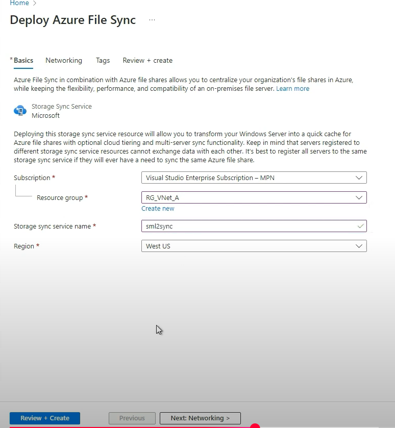

## Azure file sync

- allows you to centralize your organization's file shares in Azure, while keeping the flexibility, performance and compatiilbility of an on-premises file server.

## Lab
1. Deploy Azure File Sync:

    

    Network:

    

2. Download the Azure File Sync agent on servers you want to sync to Azure file share:

    

    

    

    

    

    Check the server if sucessfully register or not:

    

3. Create a sync group for file share:

    

4. Add a server endpoints from on-premises files:

    

    