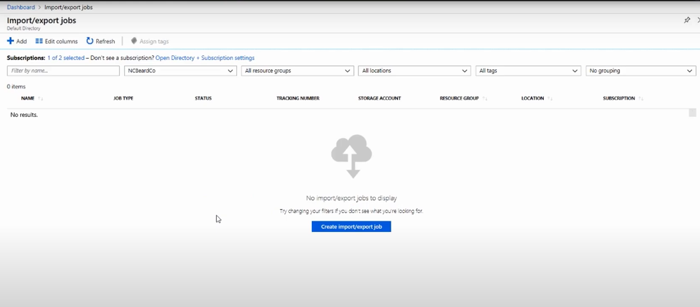
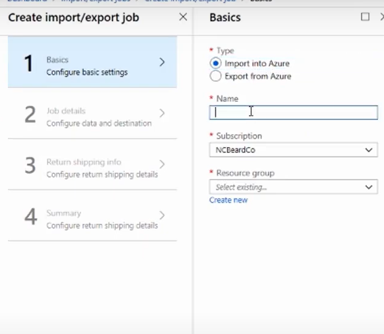
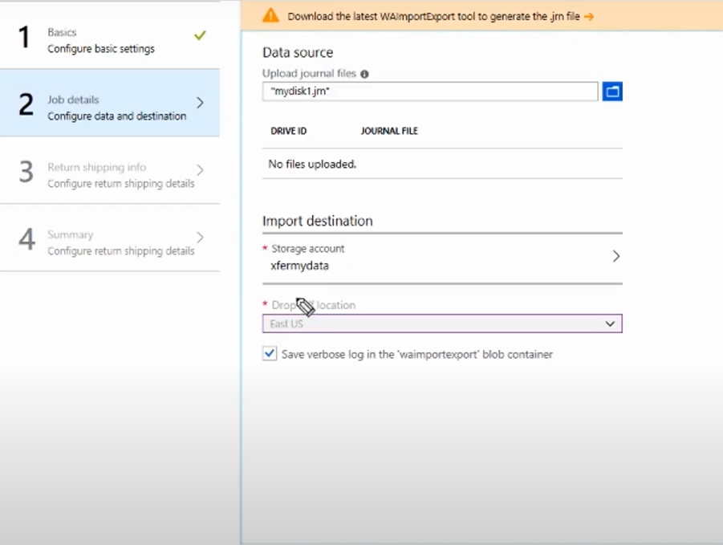

## Azure import/export job

#### ✅ 第一步： 创建import/export job:

#### ✅ 第二步： prepare source data and destination：

在本地服务器安装WAImportExport tool生成.jm file(你的硬盘会被bitlocker加密等等操作),然后将.jm file上传作为source data：

#### ✅ 第三步： 邮寄你的driver以及寄回你的driver

