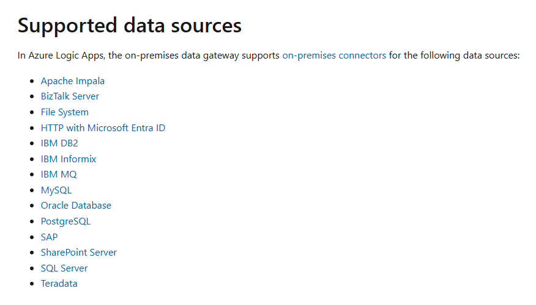
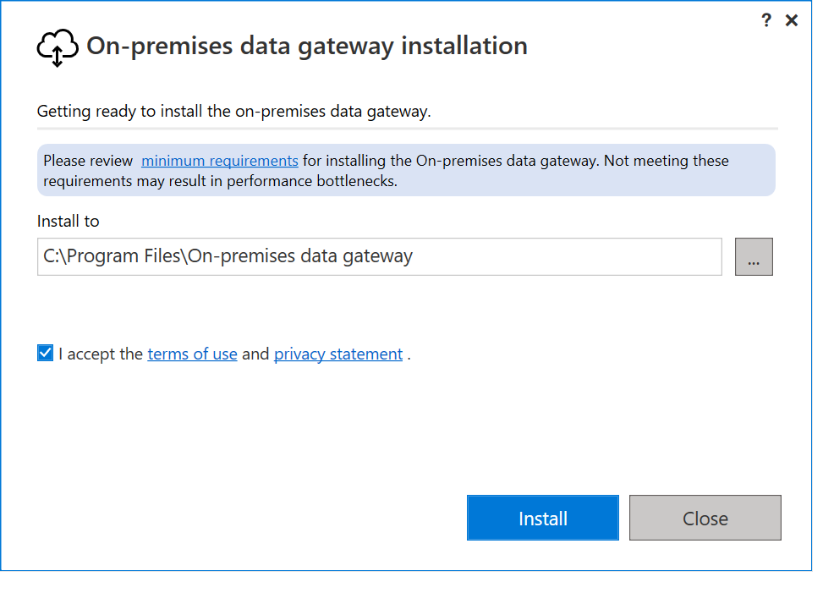
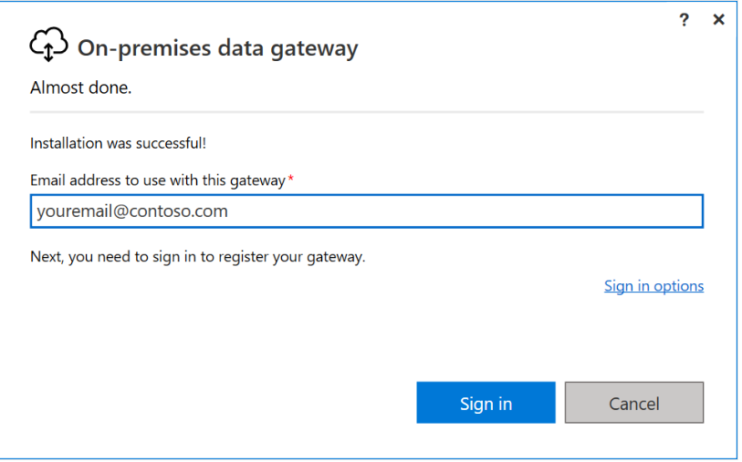
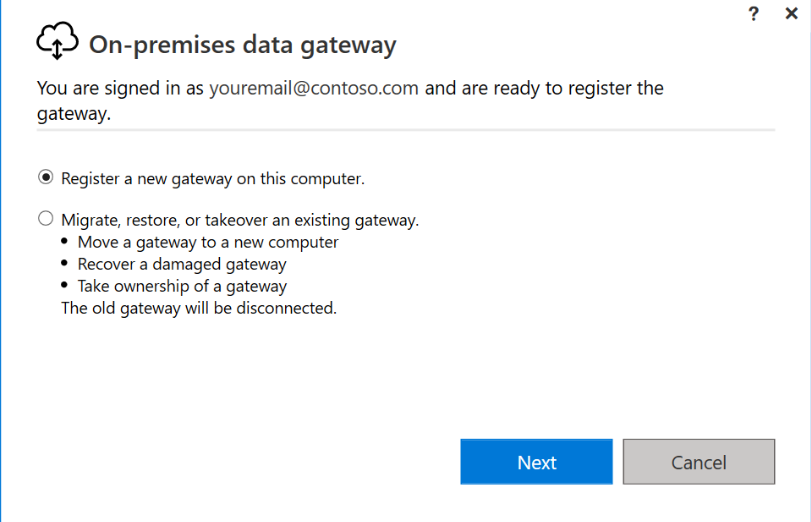
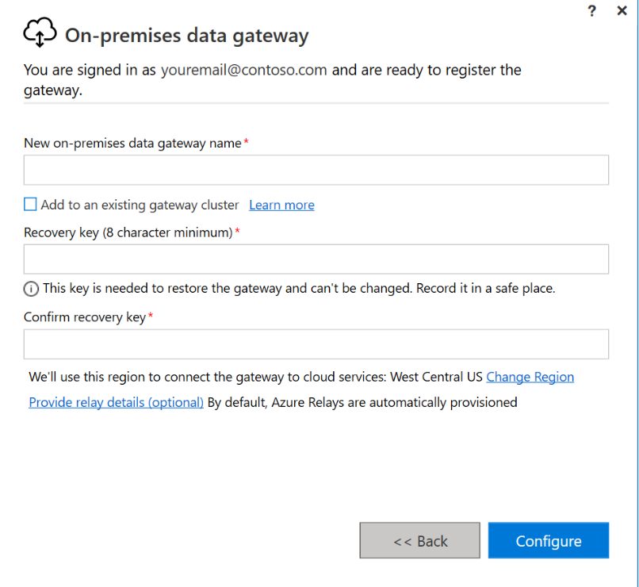
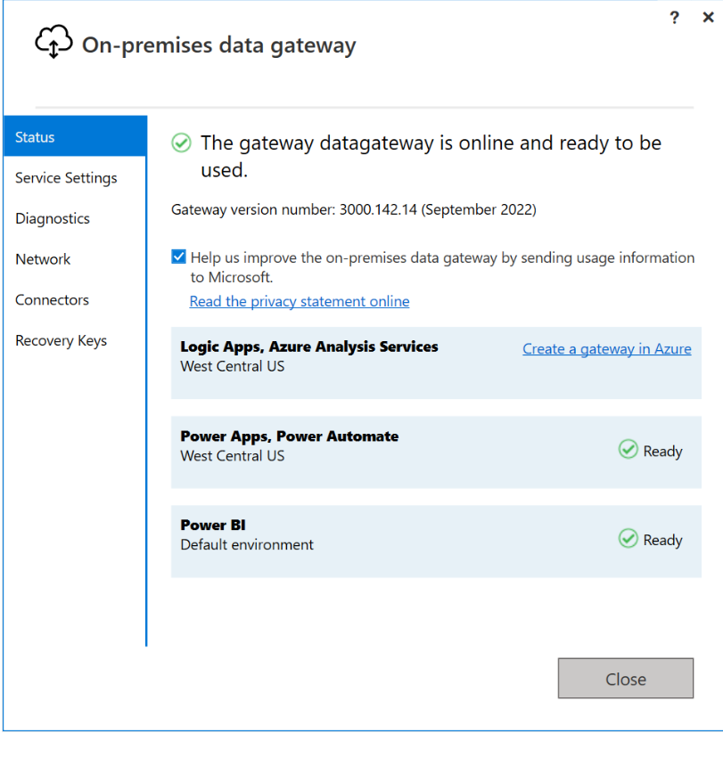
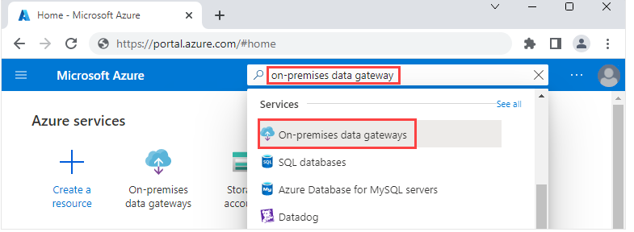
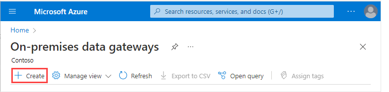
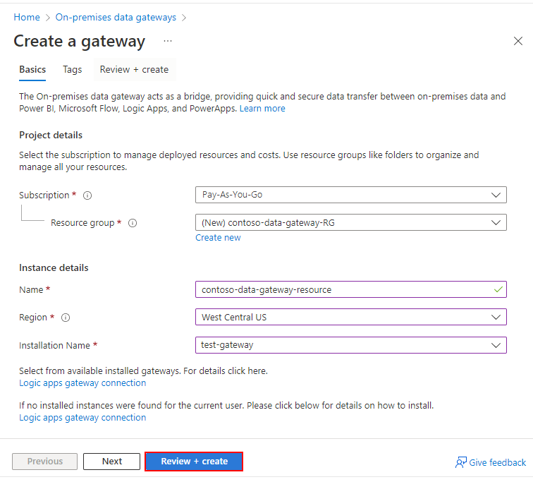
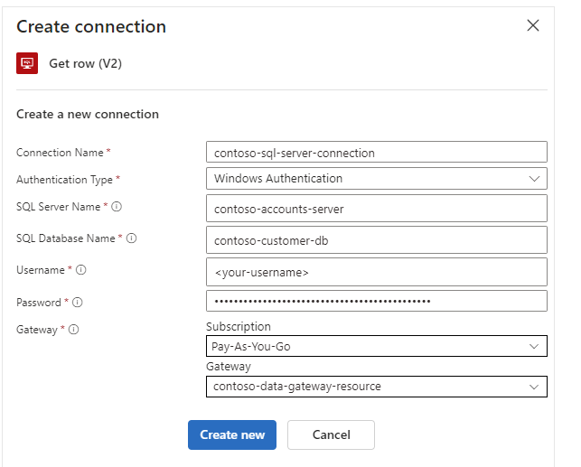

## Data gateway and azure gateway
    Applies to: Azure Logic Apps (Consumption + Standard)

1. Create on-premises data gateway on local computer:

    

    

    

    

    

2. Create Azure gateway resource:

    

    

    

3. Connect to the gateway in logic app:

    