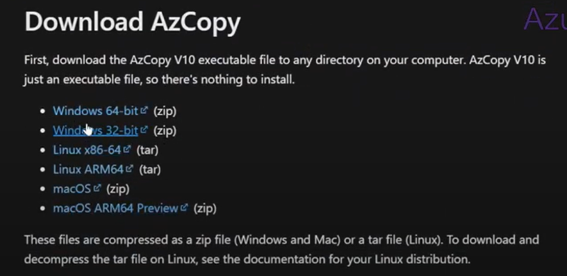
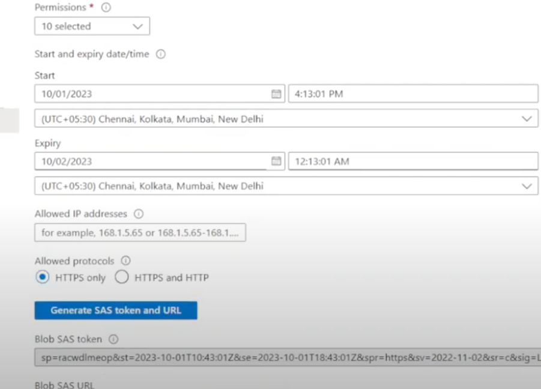
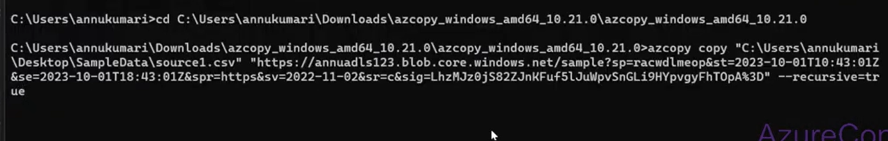

## Azcopy

快速从本地复制数据到azure blob/blob to blob等的工具

Lab: on-premise to blob

1. 下载azcopy：

    

2. 生成一个又write permission的SAS URL：

    

3. 跑命令：
    换到azcopy工具下的目录，跑az copy "上传文件的本地路径" "blob SAS URL"

    

    文件上传成功
