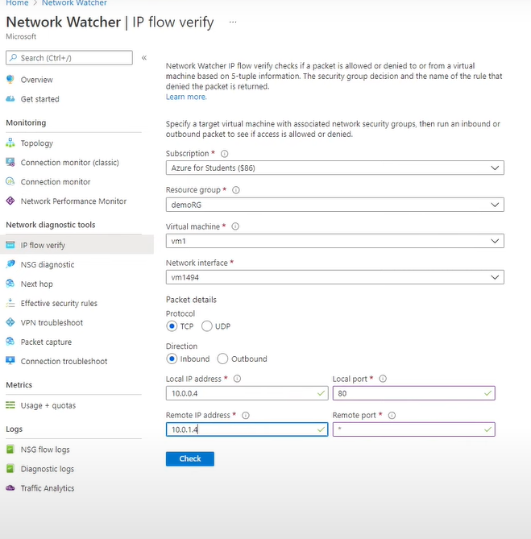

## Azure IP flow verify

IP Flow Verify is a tool in Azure Network Watcher that checks whether a specific traffic flow **between Azure VMs** (based on source IP, destination IP, port, and protocol) is **allowed or denied by a Network Security Group (NSG)**.

