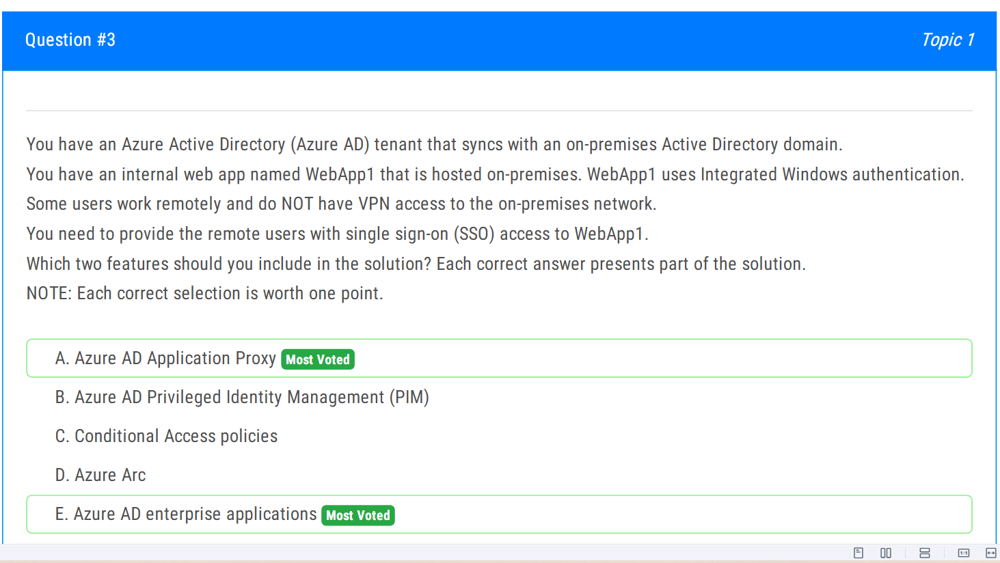

7页：

1. 在本地web app网络中部署 Application Proxy Connector（如前所讲）
2. 在 Azure AD 中注册一个 Enterprise Application
3. 配置为使用 Integrated Windows Authentication
4. 开启 SSO 使用 Kerberos Constrained Delegation
5. 配置该 Connector 使用一个有权 impersonate 用户的本地服务账户（配置 SPN + KCD）
6. 用户登录 Azure AD → 访问 App Proxy 地址 → Connector 用 KCD 模拟用户身份 → 拿票 → 本地 WebApp 验证通过