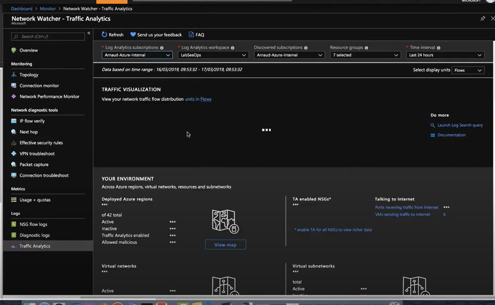
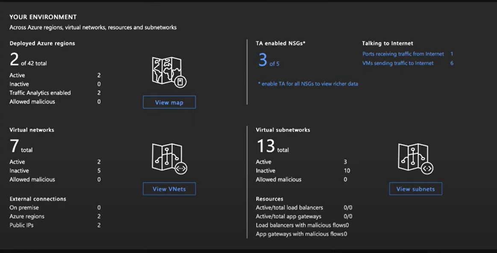
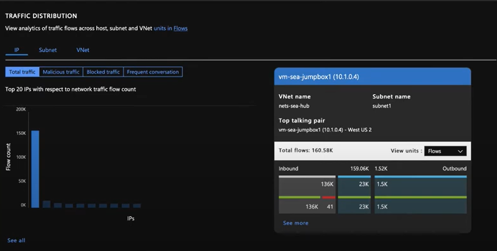
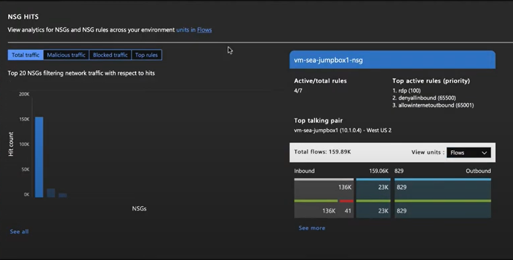
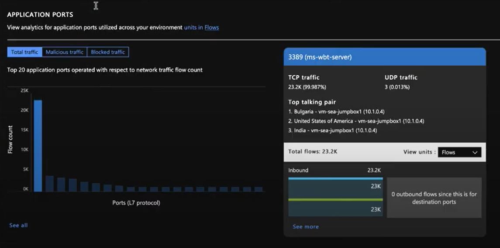
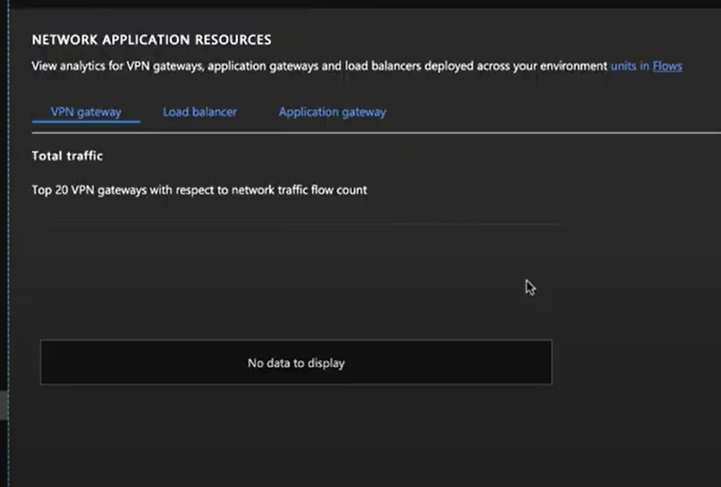

## Azure traffic analytics
It is a feature of Network Watcher, the overview page looks like:

#### Network flow distribution:

#### Traffic Distribution:

#### NSG Hit:

#### Application ports:

#### Network Application Resources

