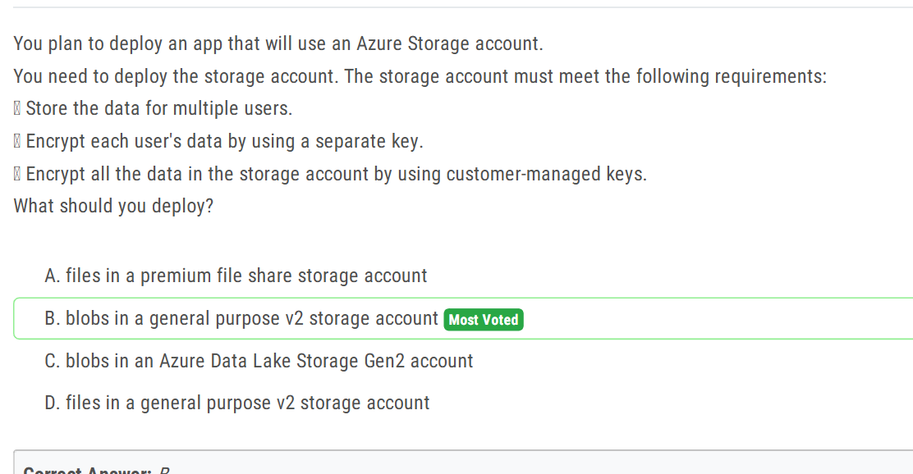
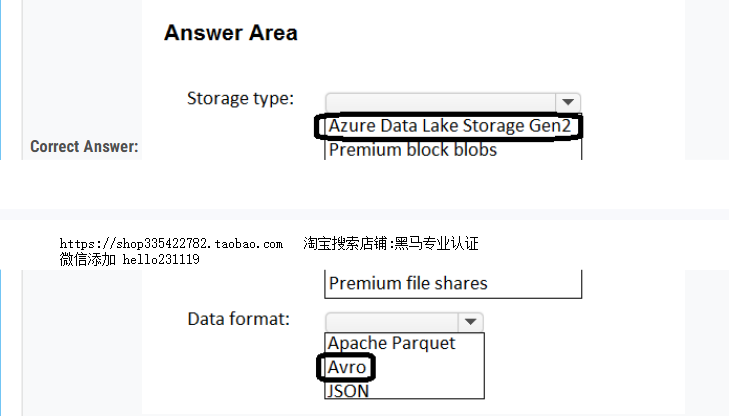
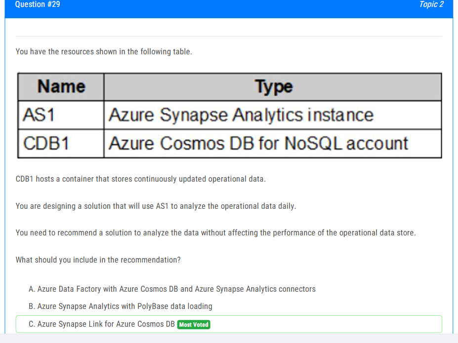
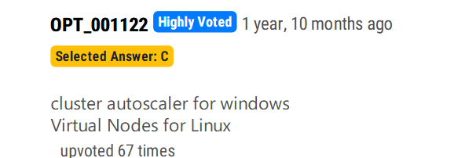
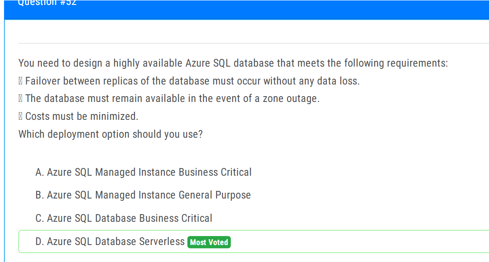
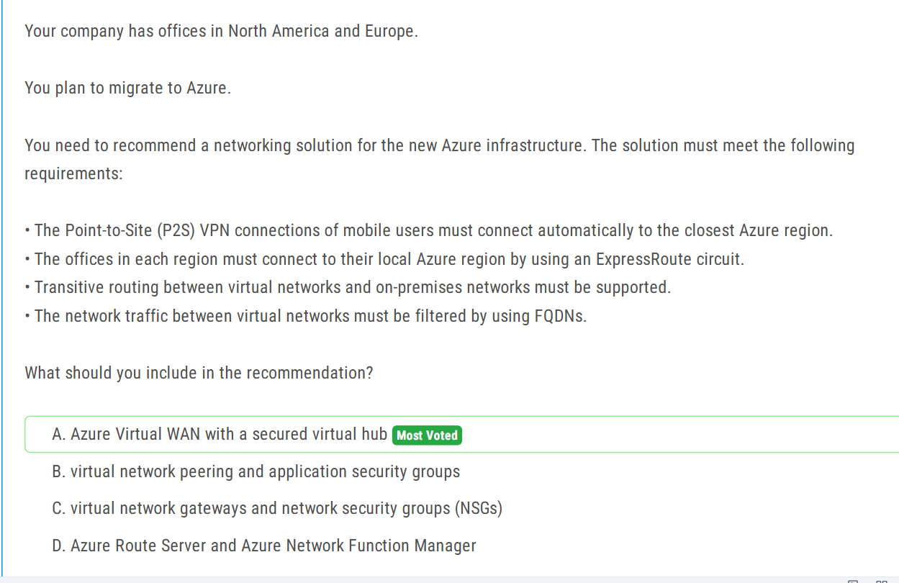
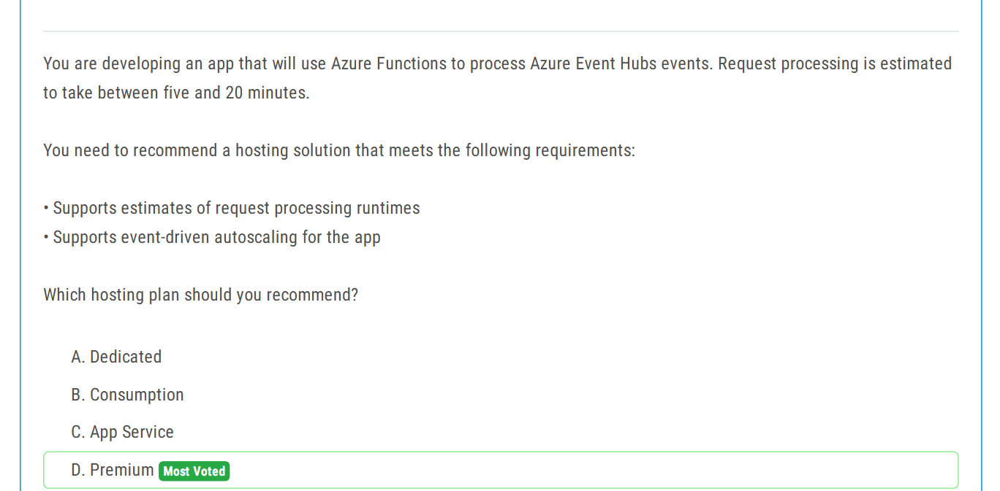

14页

解释：
You can **authenticate automatically to ADLS from Azure Databricks clusters** using the **same Microsoft Entra ID identity** that you use to log into Azure Databricks. When you enable Azure Data Lake Storage **credential passthrough** for your cluster, commands that you run on that cluster can read and write data in Azure Data Lake Storage without requiring you to configure service principal credentials for access to storage.

Azure Data Lake Storage c**redential passthrough is supported with Azure Data Lake Storage only.** Azure Blob storage does not support credential passthrough.
https://learn.microsoft.com/en-us/azure/databricks/archive/credential-passthrough/adls-passthrough#adls-aad-credentials

19 页

33 页

57 页

[text](../Lab/Azure_API_management.md)

64 页

70 页

[text](../Lab/Azure_Blueprint.md)

答案是224或者222，不确定

84 页

[text](../Lab/dynamic_data_masking.md)

87 页

91 页

95 页

99 页

106 页

122 页

150 页

145 页

217 页

246 页

[text](../Lab/Azure_import_export_job.md)

[text](../../Storage/Azure_DataFactory.md)

253 页

258 页

270 页

274 页

281 页

287 页

315 页

327 页

332 页

341 页

345 页

348 页

353 页

378 页

380 页

404 页

488 页

491 页

Failover不支持ZRS

493 页

499 页

502 页

509 页

[text](../Lab/Logic_app_connect_to_on_premise.md)

521 页

528 页

533 页

542 页

HPC：

Azure Cyclecloud:

554 页

564 页

[AZFunction_Lab](../Lab/Azure_Function.md)

570 页

576 页

583 页

586 页

我认为是A

589 页

593 页

596 页

608 页

613 页

630 页

637 页

641 页

651 页

654 页

658 页

661 页

666 页

670 页

686 页

Geo-Replication is a premium SKU container registry feature.

688 页

693 页

697 页

729 页

[text](../../Network/Azure_Virtual_Wan.md)

740 页

744 页

748 页

755 页

758 页

762 页

780 页

793 页

[text](../Lab/Azure_Data_Studio.md)

814 页

826 页

833 页

837 页

842 页

844 页

846 页

868 页

1,2

875 页

879 页

